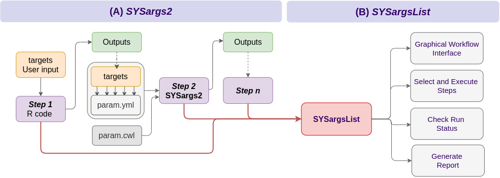
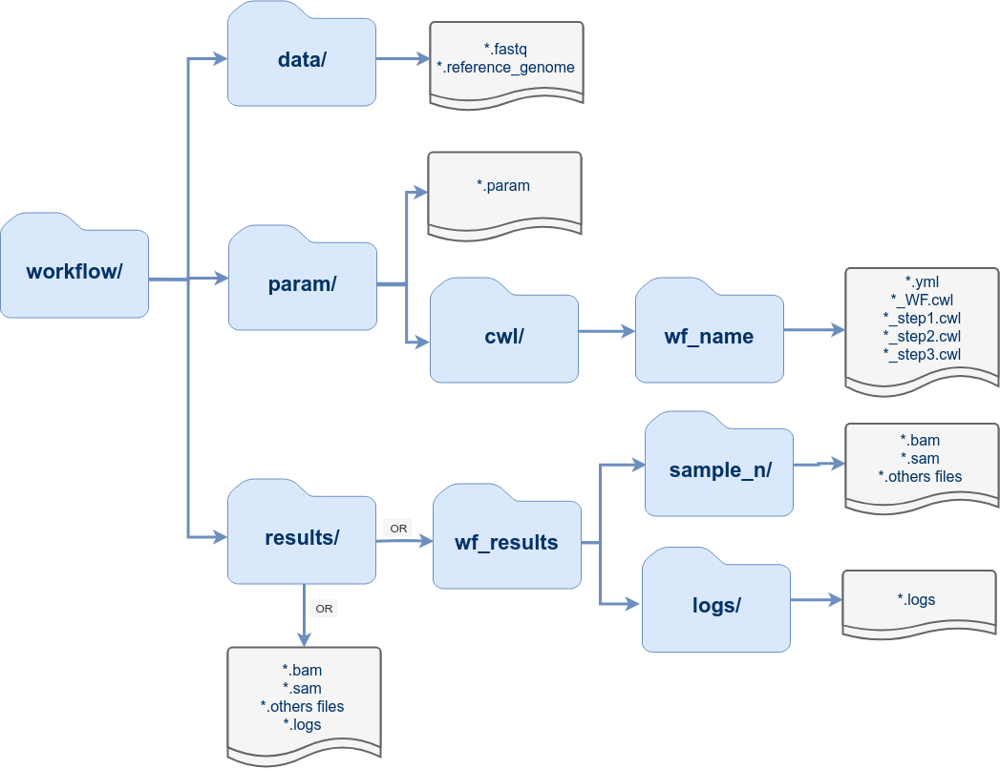
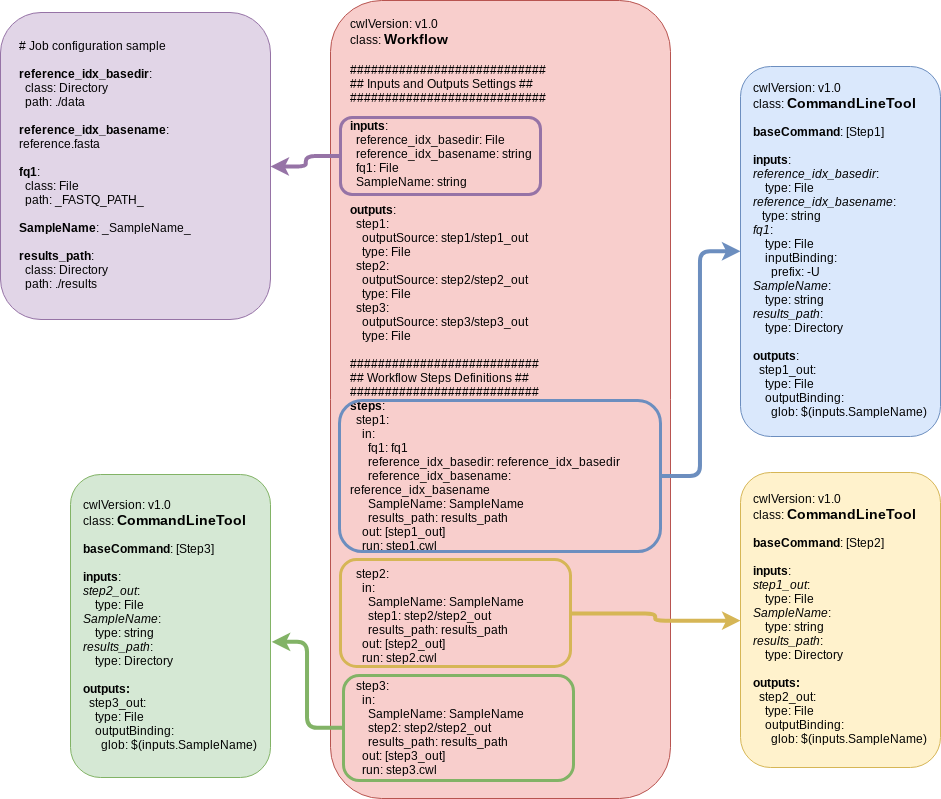

layout: true
background-image: url(https://raw.githubusercontent.com/tgirke/systemPipeR/gh-pages/images/systemPipeR.png)
background-position: 99% 1%
background-size: 10%

```{r setup, include=FALSE, message=FALSE}
options(htmltools.dir.version = FALSE)
htmltools::tagList(rmarkdown::html_dependency_font_awesome())
library(systemPipeR)
```

```{r xaringan-themer, include=FALSE, warning=FALSE}
library(xaringanthemer)
style_mono_accent(
  base_color = "#00758a",
  header_font_google = google_font("Montserrat"),
  text_font_google   = google_font("Montserrat", "300", "300i"),
  code_font_google   = google_font("Fira Mono")
)
```

```{r xaringan-logo, echo=FALSE}
xaringanExtra::use_xaringan_extra(c("tile_view", "animate_css", "tachyons"))
```

---
class:  middle

## Outline

#### Introduction
#### Design
#### How to run a Workflow
#### Workflows Tutorial
#### Live Demo

<!-- ################## -->
<!-- ## Introduction -->
<!-- ################## -->
---
class: inverse, center, middle

# <i class="fas fa-file-code"></i> Introduction

<!-- ################## Slide ################## -->
---
##  Introduction

<i class="fas fa-hand-point-right" style="color:#00758a;"></i> 
[_systemPipeR_](http://www.bioconductor.org/packages/devel/bioc/html/systemPipeR.html) provides a suite of R/Bioconductor packages for designing, building and running end-to-end analysis workflows on local machines, HPC clusters and cloud systems, while generating at the same time publication quality analysis reports

<i class="fas fa-hand-point-right" style="color:#00758a;"></i> 
_systemPipeR_ offers many utilities to build, control, and execute
workflows entirely from R

<i class="fas fa-hand-point-right" style="color:#00758a;"></i> 
The environment takes advantage of central community S4 classes of the Bioconductor ecosystem

<i class="fas fa-hand-point-right" style="color:#00758a;"></i> 
Workflows are managed by generic workflow management containers supporting both analysis routines implemented in R code and/or command-line software

<i class="fas fa-hand-point-right" style="color:#00758a;"></i> 
Simple annotation system targets

<!-- ################## Slide ################## -->
---
### systemPipeR’s Core Functionalities 

.center[

]

<!-- ################## Slide ################## -->

---
## <i class="fas fa-toolbox"></i> Structural Features

--
.left-column[
#### WF infrastructure
]

.right-column[
*systemPipeR* offers many utilities to build, control, and execute
workflows entirely from R. The environment takes advantage of central community S4 classes
of the Bioconductor ecosystem. Workflows are managed by generic workflow management
containers supporting both analysis routines implemented in R code and/or command-line
software. A layered monitoring infrastructure is provided to design, control and debug each
step in a workflow. The run environment allows to execute workflows entirely or with a
intuitive to use step-wise execution syntax using R’s standard subsetting syntax
(runWF(sys[1:3])) or pipes (%>%).
]

---

## <i class="fas fa-toolbox"></i> Structural Features

.left-column[
#### WF infrastructure
#### Command-line support
]

.right-column[
An important feature of systemPipeR is support for
running command-line software by adopting the Common Workflow Language (CWL). The
latter is a widely adopted community standard for describing analysis workflows. This design
offers several advantages such as:

<i class="fas fa-hand-point-right" style="color:#00758a;"></i> 
seamless integration of most command-line software

<i class="fas fa-hand-point-right" style="color:#00758a;"></i> 
support to run systemPipeR workflows from R or many other popular computer languages

<i class="fas fa-hand-point-right" style="color:#00758a;"></i> 
efficient sharing of workflows across different workflow environments.
]

---
## <i class="fas fa-toolbox"></i> Structural Features

.left-column[
#### WF infrastructure
#### Command-line support
#### Parallel evaluation 
]

.right-column[
The processing time of workflows can be greatly reduced by making use
of parallel evaluations across several CPU cores on single machines, or multiple nodes of
computer clusters and cloud-based systems. systemPipeR simplifies these parallelization tasks
without creating any limitations for users who do not have access to high-performance
computer resources
]

---
## <i class="fas fa-toolbox"></i> Structural Features

.left-column[
#### WF infrastructure
#### Command-line support
#### Parallel evaluation 
#### Reports infrastructure
]

.right-column[
*systemPipeR’s* reporting infrastructure
includes three types of interconnected reports each serving a different purpose:

<i class="fas fa-hand-point-right" style="color:#00758a;"></i> 
a scientific report, based on R Markdown, contains all scientifically relevant results

<i class="fas fa-hand-point-right" style="color:#00758a;"></i> 
a technical report captures all technical information important for each workflow step, including parameter
settings, software versions, and warning/error messages, etc. 

<i class="fas fa-hand-point-right" style="color:#00758a;"></i> 
a visual report depicts the entire workflow topology including its run status in form of a workflow graph

]

---
## <i class="fas fa-toolbox"></i> Structural Features

.left-column[
#### WF infrastructure
#### Command-line support
#### Parallel evaluation 
#### Reports infrastructure
#### Shiny Web Interface
]

.right-column[
Recently, the systemPipeShiny package has been added that allows
users to design workflows in an interactive graphical user interface (GUI). In addition to
designing workflows, this new interface allows users to run and to monitor workflows in an
intuitive manner without the need of knowing R.
]

---
## <i class="fas fa-toolbox"></i> Structural Features

.left-column[
#### WF infrastructure
#### Command-line support
#### Parallel evaluation 
#### Reports infrastructure
#### Shiny Web Interface
#### Workflow Templates
]

.right-column[
A rich set of end-to-end workflow templates is provided by this
project for a wide range omics applications. In addition, users can contribute and share their
workflows with the community by submitting them to a central GitHub repository
]

<!-- ################## Slide ################## -->
---
##  Important Functions

.small[
| Function Name     | Description                                                                                                           | Category        |
|-------------------|-----------------------------------------------------------------------------------------------------------------------|-----------------|
| `genWorkenvir`    | Generates workflow templates provided by systemPipeRdata helper package / or from the individuals’ pipelines packages | Accessory       |
| `loadWorkflow`    | Constructs `SYSargs2` object from CWL param and targets files                                                         | ``SYSargs2``    |
| `renderWF`        | Populate all the command-line in an `SYSargs2` object                                                                 | ``SYSargs2``    |
| `subsetWF`        | Subsetting `SYSargs2` class slots                                                                                     | ``SYSargs2``    |
| `runCommandline`  | Executes command-line software on samples and parameters specified in `SYSargs2` object                               | ``SYSargs2``    |
| `clusterRun`      | Runs command-line software in parallel mode on a computer cluster                                                     | ``SYSargs2``    |
| `writeTargetsout` | Write updated targets out to file/Generate targets file with reference                                                | ``SYSargs2``    |
| `output_update`   | Updates the output files paths in the `SYSargs2` object                                                               | ``SYSargs2``    |
| `singleYML`       | Create automatically the `param.yml`                                                                                  | ``SYSargs2``    |
| `createWF`        | Create automatically `param.cwl` and the `param.yml` based on the command line                                        | ``SYSargs2``    |
| `config.param`    | Custom configuration of the CWL param files from R                                                                    | ``SYSargs2``    |
]

---
##  Important Functions

.small[
| Function Name     | Description                                                                                                           | Category        |
|-------------------|-----------------------------------------------------------------------------------------------------------------------|-----------------|
| `initWF`          | Constructs `SYSargsList` workflow control module (S4 object) from script file                                         | ``SYSargsList`` |
| `configWF`        | Control of which step of the workflow will be run and the generation of the new RMarkdown                             | ``SYSargsList`` |
| `runWF`           | Runs all the R chunk define in the RMarkdown file or a subset, e.g. `runWF[1:3]`                                      | ``SYSargsList`` |
| `renderReport`    | Render Scientific Report based on RMarkdown                                                                           | ``SYSargsList`` |
| `subsetRmd`       | Write updated subset Rmarkdown of R chunk with text associate in the step selected                                    | ``SYSargsList`` |
| `plotWF`          | Plot visual workflow designs and topologies with different graphical layouts                                          | ``SYSargsList`` |
| `statusWF`        | Return the overview of the workflow steps computational status                                                        | ``SYSargsList`` |
| `evalCode`        | Turn eval option `TRUE` or `FALSE` on RMarkdown file                                                                  | Accessory       |
| `tryCL`           | Checks if third-party software or utility is installed and set in the PATH                                            | Accessory       |
]


<!-- ################## -->
<!-- ## Design -->
<!-- ################## -->
---
class: inverse, center, middle

# <i class="fas fa-drafting-compass"></i> Design

---
### Workflow Management Solutions

<i class="fas fa-hand-point-right" style="color:#00758a;"></i> 
*systemPipeR* central concept for designing workflows is **workflow
management containers** (S4 class)

<i class="fas fa-hand-point-right" style="color:#00758a;"></i> 
*SYSargs2* controls workflow steps with input/output file operations 

<i class="fas fa-hand-point-right" style="color:#00758a;"></i> 
*SYSargs2* requires a targets and a set of workflow definition files (here param.cwl and param.yml)

<!-- <i class="fas fa-hand-point-right" style="color:#00758a;"></i>  -->
<!-- Any number of predefined or custom workflow steps is supported -->

<i class="fas fa-hand-point-right" style="color:#00758a;"></i> 
*SYSargsList* objects organize one or many *SYSargs2*
containers in a single compound object capturing all information required to run, control and
monitor complex workflows from start to finish

.center[

]

---
## <i class="far fa-folder-open"></i> Directory Structure

The workflow templates generated by _`genWorkenvir`_ contain the following preconfigured directory structure:



---
## <i class="fas fa-project-diagram"></i> Workflows Collection

Browse pipelines that are currently available as part of the *systemPipeR* toolkit

.small[
| WorkFlow |  Description  | Version | GitHub | CI Testing | 
|:-----------------------:|:----------------:|:----------------:|:--------------------:|:-------------------------------:|
| [systemPipeChIPseq](https://systempiper.github.io/systemPipeChIPseq/articles/systemPipeChIPseq.html) | ChIP-Seq Workflow Template | v1.0  | <a href="https://github.com/systemPipeR/systemPipeChIPseq">  |  |
| [systemPipeRIBOseq](https://systempiper.github.io/systemPipeRIBOseq/articles/systemPipeRIBOseq.html) | RIBO-Seq Workflow Template | v1.0  | <a href="https://github.com/systemPipeR/systemPipeRIBOseq">  |  |
| [systemPipeRNAseq](https://systempiper.github.io/systemPipeRNAseq/articles/systemPipeRNAseq.html) | RNA-Seq Workflow Template | v1.0  | <a href="https://github.com/systemPipeR/systemPipeRNAseq">  |  |
| [systemPipeVARseq](https://systempiper.github.io/systemPipeVARseq/articles/systemPipeVARseq.html) | VAR-Seq Workflow Template | v1.0  | <a href="https://github.com/systemPipeR/systemPipeVARseq">  |  |
| [systemPipeMethylseq](https://github.com/systemPipeR/systemPipeMethylseq) | Methyl-Seq Workflow Template | devel  | <a href="https://github.com/systemPipeR/systemPipeMethylseq">  |  |
| [systemPipeDeNovo](https://github.com/systemPipeR/systemPipeDeNovo) | De novo transcriptome assembly Workflow Template | devel  | <a href="https://github.com/systemPipeR/systemPipeDeNovo">  |  |
| [systemPipeCLIPseq](https://github.com/systemPipeR/systemPipeCLIPseq) | CLIP-Seq Workflow Template | devel  | <a href="https://github.com/systemPipeR/systemPipeCLIPseq">  |  |
| [systemPipeMetaTrans](https://github.com/systemPipeR/systemPipeMetaTrans) | Metatranscriptomic Sequencing Workflow Template | devel  | <a href="https://github.com/systemPipeR/systemPipeMetaTrans">  |  |
]

---
class: inverse, center, middle

# CWL

---
## <i class="fas fa-box-open"></i> CWL

<i class="fas fa-circle" style="color:#00758a;"></i> **TODO:**
Add section with CWL details

.center[

]

---
## <i class="fas fa-box-open"></i> CWL and SPR

<i class="fas fa-circle" style="color:#00758a;"></i> **TODO:**
How to use CWL definition with *systemPipeR*

- *SYSargs2* instances are constructed from a *`targets`* file and two *`param`* file
  - *`hisat2-mapping-se.cwl`* file contains the settings for running command-line software
  - *`hisat2-mapping-se.yml`* file define all the variables to be input in the specific command-line step </h4>
    
```{r sysargs2*instance, eval=TRUE, messages=FALSE, warnings=FALSE, cache=TRUE}
targets <- system.file("extdata", "targets.txt", package="systemPipeR")
dir_path <- system.file("extdata/cwl/hisat2/hisat2-se", package="systemPipeR")
align <- loadWF(targets=targets, wf_file="hisat2-mapping-se.cwl",
                   input_file="hisat2-mapping-se.yml", dir_path=dir_path)
align <- renderWF(align, inputvars=c(FileName="_FASTQ_PATH_", SampleName="_SampleName_"))

## Instance of 'SYSargs2':
##    Slot names/accessors: 
##       targets: 18 (M1A...V12B), targetsheader: 4 (lines)
##       modules: 2
##       wf: 0, clt: 1, yamlinput: 7 (components)
##       input: 18, output: 18
##       cmdlist: 18
##    WF Steps:
##       1. hisat2-mapping-se.cwl (rendered: TRUE)
```

---
## <i class="fas fa-box-open"></i> CWL and SPR

## *`SYSargs2`* instance 

- Slots and accessor functions have the same names
```{r align_names, eval=FALSE, messages=FALSE, warnings=FALSE, cache=TRUE}
names(align)
#  [1] "targets"       "targetsheader" "modules"       "wf"            "clt"          
#  [6] "yamlinput"     "cmdlist"       "input"         "output"        "cwlfiles"     
# [11] "inputvars" 
```

- *`cmdlist`* return command-line arguments for the specific software, here *`HISAT2`* for the first sample
```{r cmdlist, eval=FALSE, messages=TRUE, warnings=FALSE, cache=TRUE}
cmdlist(align)[1]
# $M1A
# $M1A$`hisat2-mapping-se.cwl`
# [1] "hisat2 -S results/M1A.sam  -x ./data/tair10.fasta  -k 1  --min-intronlen 30  --max-intronlen 3000  -U ./data/SRR446027_1.fastq.gz --threads 4"
```

- The output components of *`SYSargs2`* define all the expected output files for each step in the workflow; some of which are the input for the next workflow step

```{r sysargs2_args_results, eval=FALSE, messages=FALSE, warnings=FALSE, cache=TRUE}
output(align)[1]
# $M1A
# $M1A$`hisat2-mapping-se.cwl`
# [1] "results/M1A.sam"
```

---
class: inverse, center, middle

# <i class="fas fa-table"></i> Metadata

---
### <i class="fas fa-box-open"></i> *Targets* file organizes samples

- Structure of *`targets`* file for single-end (SE) library
```{r show*targetsSE, eval=TRUE, messages=FALSE, warnings=FALSE, cache=TRUE}
targetspath <- system.file("extdata", "targets.txt", package="systemPipeR")
read.delim(targetspath, comment.char = "#")[1:3,1:4]
```

- Structure of *`targets`* file for paired-end (PE) library
```{r show*targetsPE, eval=TRUE, messages=FALSE, warnings=FALSE, cache=TRUE}
targetspath <- system.file("extdata", "targetsPE.txt", package="systemPipeR")
read.delim(targetspath, comment.char = "#")[1:3,1:5]
```

---
### <i class="fas fa-box-open"></i> Integration with *SummarizedExperiment*

- Integrates *targets* files and count table from *systemPipeR* to a *SummarizedExperiment* object

```{r SummarizedExperiment, eval=FALSE, messages=FALSE, warnings=FALSE, cache=TRUE}
## Create an object with targets file and comparison and count table
sprSE <- SPRdata(targetspath = targetspath, cmp=TRUE)
metadata(sprSE)
# $version
# [1] ‘1.23.9’
# 
# $comparison
# $comparison$CMPset1
#       [,1]  [,2] 
#  [1,] "M1"  "A1" 
#  [2,] "M1"  "V1" 
#  [3,] "A1"  "V1" 
#  [4,] "M6"  "A6" 

colData(sprSE)
# DataFrame with 18 rows and 6 columns
#                    FileName  SampleName      Factor  SampleLong 
#                 <character> <character> <character> <character> 
# M1A  ./data/SRR446027_1.f..         M1A          M1   Mock.1h.A 
# M1B  ./data/SRR446028_1.f..         M1B          M1   Mock.1h.B 
# ...                     ...         ...         ...         ... 
# M12B ./data/SRR446040_1.f..        M12B         M12  Mock.12h.B
```

---
class: inverse, center, middle

# <i class="fas fa-code"></i> Live Demo 

---
## <i class="fas fa-box-open"></i> Install Package

Install the **systemPipeRdata** package from [Bioconductor](http://www.bioconductor.org/packages/release/data/experiment/html/systemPipeRdata.html):

```{r eval=FALSE, tidy=FALSE}
if (!requireNamespace("BiocManager", quietly=TRUE))
    install.packages("BiocManager")
BiocManager::install("systemPipeR")
```

### <i class="fas fa-book"></i> Load Package and Documentation

<i class="fas fa-question" style="color:#00758a;"></i> 
Load package:

```{r load_systemPipeRdata_print, eval=FALSE, messages=FALSE, warnings=FALSE, cache=TRUE, results='hide'}
library("systemPipeR")
```

<i class="fas fa-question" style="color:#00758a;"></i> 
Access help:

```{r accessing_help, eval=FALSE, messages=FALSE, warnings=FALSE, cache=TRUE}
library(help="systemPipeR")
vignette("systemPipeR")
```

---
## <i class="fas fa-code"></i> Quick Start

### Load Sample Workflow

<i class="fas fa-hand-point-right" style="color:#00758a;"></i> 
*systemPipeRdata*

- Helper package to generate with a single command workflow templates for *systemPipeR*
- Includes sample data for testing
- User can create new workflows or change and extend existing ones
- Template Workflows:
    - Sample workflows can be loaded with the *`genWorkenvir`* function from **systemPipeRdata**

<i class="fas fa-hand-point-right" style="color:#00758a;"></i> 
Generate workflow template:

```{r load_sample, eval=FALSE, messages=FALSE, warnings=FALSE, cache=TRUE}
library(systemPipeRdata)
genWorkenvir(workflow="rnaseq")
setwd("rnaseq")
```

<i class="fas fa-hand-point-right" style="color:#00758a;"></i> 
More details about *systemPipeRdata* package [here](https://systempipe.org/pages/SPRdata_intro/SPRdata_intro#1)

---
## <i class="fas fa-box-open"></i> Install Workflow

<i class="fas fa-hand-point-right" style="color:#00758a;"></i> 
Check the workflow template availability 
```{r eval=FALSE, tidy=FALSE}
availableWF(github = TRUE)

# $systemPipeRdata
# [1] "chipseq" "new"     "riboseq" "rnaseq"  "varseq" 
# 
# $github
#                          workflow                       branches version                                               html       description
# 1   systemPipeR/systemPipeChIPseq                         master release   https://github.com/systemPipeR/systemPipeChIPseq Workflow Template
# 2   systemPipeR/systemPipeRIBOseq                         master release   https://github.com/systemPipeR/systemPipeRIBOseq Workflow Template
# 3    systemPipeR/systemPipeRNAseq cluster, master, singleMachine release    https://github.com/systemPipeR/systemPipeRNAseq Workflow Template
# 4    systemPipeR/systemPipeVARseq                         master release    https://github.com/systemPipeR/systemPipeVARseq Workflow Template
# 5   systemPipeR/systemPipeCLIPseq                         master   devel   https://github.com/systemPipeR/systemPipeCLIPseq Workflow Template
# 6    systemPipeR/systemPipeDeNovo                         master   devel    https://github.com/systemPipeR/systemPipeDeNovo Workflow Template
# 7 systemPipeR/systemPipeMetaTrans                         master   devel https://github.com/systemPipeR/systemPipeMetaTrans Workflow Template
# 8 systemPipeR/systemPipeMethylseq                         master   devel https://github.com/systemPipeR/systemPipeMethylseq Workflow Template
```

---
## <i class="fas fa-mouse-pointer"></i> Dynamic Workflow Template

<i class="fas fa-hand-point-right" style="color:#00758a;"></i> 
Create dynamic Workflow Templates with *RStudio*

<i class="fas fa-hand-point-right" style="color:#00758a;"></i> 
`File -> New File -> R Markdown -> From Template`
.center[

]


---
## <i class="fas fa-toolbox"></i> Run a Workflow

.left-column[
### Setup
]

.right-column[
```{r eval=TRUE, messages=FALSE, warnings=FALSE, cache=TRUE, tidy=FALSE}
library(systemPipeR)
targetspath <- system.file("extdata", "targets.txt", package="systemPipeR") 
read.delim(targetspath, comment.char = "#")[1:4,1:4]
script <- system.file("extdata/workflows/rnaseq", "systemPipeRNAseq.Rmd", package="systemPipeRdata")
```
]

---
## <i class="fas fa-toolbox"></i> Run a Workflow

.left-column[
### Setup
### `initWF`
]

.right-column[
```{r eval=FALSE, messages=FALSE, warnings=FALSE, cache=TRUE, tidy=FALSE}
sysargslist <- initWF(script = script, targets = targetspath, overwrite = TRUE)
# Project started with success: ./SYSproject and SYSconfig.yml were created.
```
]

---
## <i class="fas fa-toolbox"></i> Run a Workflow

.left-column[
### Setup
### `initWF`
### `configWF`
]

.right-column[
```{r eval=FALSE, messages=FALSE, warnings=FALSE, cache=TRUE, tidy=FALSE}
sysargslist <- configWF(sysargslist, input_steps = "1:3")
sysargslist
# Instance of 'SYSargsList':
#    WF Steps:
# 1. Rmarkdown/HTML setting
# 2. Introduction
# 3. Samples and environment settings
#     3.1. Environment settings and input data
#     3.2. Required packages and resources
#     3.3. Experiment definition provided by `targets` file
```
]

---
## <i class="fas fa-toolbox"></i> Run a Workflow

.left-column[
### Setup
### `initWF`
### `configWF`
### `runWF`
]

.right-column[
```{r eval=FALSE, messages=FALSE, warnings=FALSE, cache=TRUE, tidy=FALSE}
sysargslist <- runWF(sysargslist, steps = "1:2")
# Step: 1: Introduction --> DONE 
# Step: 2: Samples and environment settings --> DONE 
# Step: 2.1: Environment settings and input data --> DONE 
# Step: 2.2: Required packages and resources --> DONE 
# Step: 2.3: Experiment definition provided by `targets` file --> DONE 
```

```{r eval=FALSE, messages=FALSE, warnings=FALSE, cache=TRUE, tidy=FALSE}
sysargslist <- runWF(sysargslist, steps = "ALL")

```
]

---
## <i class="fas fa-toolbox"></i> Run a Workflow

.left-column[
### Setup
### `initWF`
### `configWF`
### `runWF`
### `renderReport`
]

.right-column[
```{r eval=FALSE, messages=FALSE, warnings=FALSE, cache=TRUE, tidy=FALSE}
sysargslist <- renderReport(sysargslist = sysargslist)
```
]

---
## How to Use Pipes `%>%`

Consider the following example, in which the steps are the initialization, configuration and running the entire workflow.

```{r pipes, eval=FALSE}
library(systemPipeR)
sysargslist <- initWF(script ="systemPipeRNAseq.Rmd", overwrite = TRUE) %>%
    configWF(input_steps = "1:6") %>%
    runWF(steps = "1:2")
```

---
class: inverse, center, middle

# <i class="fas fa-tasks"></i> Project Updates

---
### *targets* x *SummarizedExperiment*
<i class="fas fa-check-circle" style="color:#00758a;"></i> 
Extension "SummarizedExperiment" methods:

```{r, eval=FALSE}
sprSE <- addAssay(sprSE, assay(countMatrix), xName="countMatrix")
sprSE <- addMetadata(sprSE, list(targets), xName="metadata")
```

<i class="fas fa-check-circle" style="color:#00758a;"></i> 
New Function:

```{r eval=FALSE}
## Create empty SummarizedExperiment
sprSE <- SPRdata()

## Create an object with targets file and comparison and count table
sprSE <- SPRdata(counts = countMatrix, cmp=TRUE, targetspath = targetspath)
metadata(sprSE)
colData(sprSE)
assays(sprSE)
```

---
## SPR Paper

<i class="fas fa-check-circle" style="color:#00758a;"></i> 
[Link to draft](https://www.overleaf.com/project/5e94948a23918a000116311c)

<i class="fas fa-check-circle" style="color:#00758a;"></i> 
Added the main points to discuss in the draft

<i class="fas fa-arrow-circle-right" style="color:#00758a;"></i>
Writing: Results and introduction

<i class="fas fa-circle" style="color:#00758a;"></i>
Improve Graphical Abstract 

<i class="fas fa-circle" style="color:#00758a;"></i>
Show case?

---
## *SYSargsList*

<i class="fas fa-check-circle" style="color:#00758a;"></i> 
Explain how *SYSargsList* is implemented - Vignette

.small[
| Function Name  | Description                                                                               |
|----------------|-------------------------------------------------------------------------------------------|
| `initWF`       | Constructs `SYSargsList` workflow control module (S4 object) from script file             |
| `configWF`     | Control of which step of the workflow will be run and the generation of the new RMarkdown |
| `runWF`        | Runs all the R chunk define in the RMarkdown file or a subset, e.g. `runWF[1:3]`          |
| `renderReport` | Render Scientific Report based on RMarkdown                                               |
| `renderLog`    | Render logs Report based on RMarkdown                                                     |
| `updateWF`     | Recover the `SYSargsList` workflow previous ran and restarts the WF                       |
| `plotWF`       | Plot visual workflow designs and topologies with different graphical layouts              |
| `statusWF`     | Return the overview of the workflow steps computational status                            |
| `evalCode`     | Turn eval option `TRUE` or `FALSE` on RMarkdown file                                      |
| `tryCL`        | Checks if third-party software or utility is installed and set in the PATH                |
]

<i class="fas fa-circle" style="color:#00758a;"></i>
Improve `statusWF()`

---
## Visualization in *systemPipeR*

<i class="fas fa-check-circle" style="color:#00758a;"></i> 
Add to vignette (SPR or SPS)
 - `exploreDDS`, `exploreDDSplot`, `GLMplot`, `MAplot`, `MDSplot`, `PCAplot`, `hclustplot`, `heatMaplot`, `tSNEplot`, `volcanoplot` 

<i class="fas fa-circle" style="color:#00758a;"></i>
Enrichment analysis and visualization tool for SPR
- Integration with `FGSEA` 


---
## WebSite

<i class="fas fa-check-circle" style="color:#00758a;"></i> 
Updated the vignette

<i class="fas fa-check-circle" style="color:#00758a;"></i> 
Added *systemPipeRdata* vignette and presentation: [link](https://systempipe.org/docs/systemPipeRdata/)

<i class="fas fa-circle" style="color:#00758a;"></i>
Redirect http://girke.bioinformatics.ucr.edu/systemPipeR/ to new page

<i class="fas fa-circle" style="color:#00758a;"></i>
Add content to FAQ section

<i class="fas fa-circle" style="color:#00758a;"></i>
Add tutorials videos

---
class: middle

# Thanks!

<i class="fas fa-hand-point-right" style="color:#00758a;"></i> 
Browse source code at <a href="https://github.com/tgirke/systemPipeR/"> <i class="fab fa-github fa-2x"></i></a>

<i class="fas fa-hand-point-right" style="color:#00758a;"></i> 
Ask a question about systemPipeR at Bioconductor Support Page
<a href="https://support.bioconductor.org/t/systempiper/"><i class="far fa-question-circle fa-2x"></i></a>

<i class="fas fa-hand-point-right" style="color:#00758a;"></i> 
*systemPipeRdata* at [Bioconductor](http://www.bioconductor.org/packages/devel/bioc/html/systemPipeR.html)

<i class="fas fa-hand-point-right" style="color:#00758a;"></i> 
[https://systempipe.org/](https://systempipe.org/)

