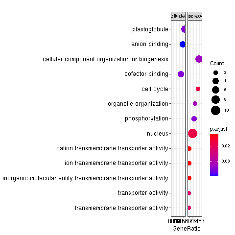
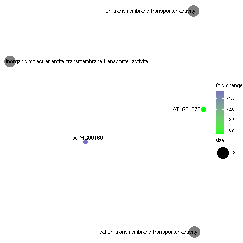
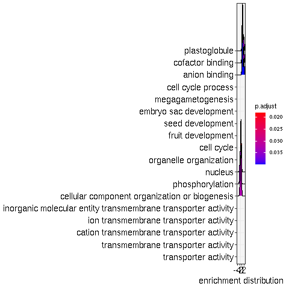

<!-- background-image: url(https://raw.githubusercontent.com/systemPipeR/systemPipeShiny/master/inst/app/www/img/sps_small.png) -->

layout: true
background-image: url(https://raw.githubusercontent.com/systemPipeR/systemPipeShiny/master/inst/app/www/img/sps_small.png)
background-position: 100% 0%
background-size: 10%

```{r setup, include=FALSE}
options(htmltools.dir.version = FALSE)
htmltools::tagList(rmarkdown::html_dependency_font_awesome())
```

```{r xaringan-themer, include=FALSE, warning=FALSE}
library(xaringanthemer)
style_mono_accent(
  base_color = "#00758a",
  header_font_google = google_font("Montserrat"),
  text_font_google   = google_font("Montserrat", "300", "300i"),
  code_font_google   = google_font("Fira Mono")
)
```

```{r xaringan-logo, echo=FALSE}
xaringanExtra::use_xaringan_extra(c("tile_view", "animate_css", "tachyons"))
```

---
class: center, middle

## Outline

#### Introduction
#### *systemPipeShiny* Demo
#### Visualization Features
#### Customize and Extend
---
class: inverse, center, middle

# Introduction

---
## Motivation

<i class="fas fa-hand-point-right" style="color:#00758a;"></i> 
Build an interactive framework for workflow management and visualization by extending all [systemPipeR](https://systempipe.org/) functionalities

.pull-left[

]
.pull-right[

]

---
## Motivation

<i class="fas fa-hand-point-right" style="color:#00758a;"></i> 
Build an interactive framework for workflow management and visualization by extending all [systemPipeR](https://systempipe.org/) functionalities

.pull-left[

]
.pull-right[


]

---
## Motivation

<i class="fas fa-hand-point-right" style="color:#00758a;"></i> 
Build an interactive framework for workflow management and visualization by extending all [systemPipeR](https://systempipe.org/) functionalities

.pull-left[
.center[

]]
.pull-right[

<a href="#add link"></a>
]

---
## Motivation

<i class="fas fa-hand-point-right" style="color:#00758a;"></i> 
Build an interactive framework for workflow management and visualization by extending all [systemPipeR](https://systempipe.org/) functionalities

.pull-left[

]
.pull-right[

```{r, echo=FALSE}
source("visual.R")
```

```{r, results='asis', echo=FALSE}
make_html_picture_link("heat_samples.svg", "#heatMap")
make_html_picture_link("cor.svg", "#cor")
make_html_picture_link("tsne.svg", "#pca")
make_html_picture_link("volcano.svg", "#volcano")
make_html_picture_link("heat.png", "#volcano")
make_html_picture_link("maplot.svg", "#logs")
```
]

---
## Motivation

<i class="fas fa-hand-point-right" style="color:#00758a;"></i> 
Build an interactive framework for workflow management and visualization by extending all [systemPipeR](https://systempipe.org/) functionalities

.pull-left[

]
.pull-right[

]

---

## Motivation

<i class="fas fa-hand-point-right" style="color:#00758a;"></i> 
Build an interactive framework for workflow management and visualization by extending all [systemPipeR](https://systempipe.org/) functionalities

<i class="fas fa-hand-point-right" style="color:#00758a;"></i> 
Provide for non-R users, such as experimentalists, to run many systemPipeR’s workflow designs, control, and visualization functionalities interactively without requiring knowledge of R

<i class="fas fa-hand-point-right" style="color:#00758a;"></i>
Provide a tool that can be used on both local computers as well as centralized server-based deployments that can be accessed remotely as a public web service for using SPR’s functionalities with the community and/or private data


---
## <i class="fas fa-toolbox"></i> Features

.middle-slide[

]

???

<i class="fas fa-wrench" style="color:#00758a;"></i>
Interactively define experimental designs and provide associated metadata
using an easy to use tabular editor and/or file uploader

<i class="fas fa-wrench" style="color:#00758a;"></i>
visualize workflow topologies combined with auto-generation of R Markdown previews for
interactively designed workflows

<i class="fas fa-wrench" style="color:#00758a;"></i>
Allows prepare the data for the visualizations tabs


---
## <i class="fas fa-toolbox"></i> Structural Features

--

.left-column[
### User friendly
]

.right-column[
 
]

---

## <i class="fas fa-toolbox"></i> Structural Features

.left-column[
### User friendly
### Progress Tracking
]

.right-column[

 

]

---
## <i class="fas fa-toolbox"></i> Structural Features

.left-column[
### User friendly
### Progress Tracking
### Canvas 
]

.right-column[
Under this workbench users can take snapshots of different plots, and combine or resize them. This
feature is useful for generating complex scientific summary graphics.


]

---
## <i class="fas fa-toolbox"></i> Structural Features

.left-column[
### Progress Tracking
]

.right-column[
Messages, warnings and errors from R functions are automatically captured and logged on
both the server and client ends.


]

---
## <i class="fas fa-toolbox"></i> Structural Features

.left-column[
### Progress Tracking
### App Config
]

.right-column[
a robust exception handling system has been implemented (similar to Shiny options), that
provides error solutions to to users, e.g. invalid parameter settings.
]


---
## <i class="fas fa-toolbox"></i> Structural Features

.left-column[
### Progress Tracking
### App Config
### Modular Design
]

.right-column[
SPS is built on Shiny modules, which provides local scope isolation between each tab.
Objects on one tab do not conflict with other tabs. To enable cross-tab communication, SPS also supports
global scope interactions
]

---
## <i class="fas fa-bezier-curve"></i> Design 


---
## <i class="fas fa-user-edit"></i> Customize and Extend 

<i class="fas fa-wrench" style="color:#00758a;"></i>
Templates are available to generate new visualization tabs

 


---
class: inverse, center, middle

# <i class="fas fa-code"></i> Live Demo 

---
## <i class="fas fa-box-open"></i> Install Package

Install the **systemPipeShiny** package from [GitHub](https://github.com/systemPipeR/systemPipeShiny):

```{r eval=FALSE, tidy=FALSE}
if (!requireNamespace("BiocManager", quietly=TRUE))
    install.packages("BiocManager")
BiocManager::install("systemPipeR/systemPipeShiny", dependencies=TRUE, build_vignettes=TRUE)
```

### <i class="fas fa-book"></i> Load Package and Documentation

<i class="fas fa-question" style="color:#00758a;"></i> 
Load packages and accessing help

```{r load_systemPipeShiny_print, eval=FALSE, messages=FALSE, warnings=FALSE, cache=TRUE, results='hide'}
library("systemPipeShiny")
```

<i class="fas fa-question" style="color:#00758a;"></i> 
Access help
```{r accessing_help, eval=FALSE, messages=FALSE, warnings=FALSE, cache=TRUE}
library(help="systemPipeShiny")
vignette("systemPipeShiny")
```

---
## <i class="fas fa-code"></i> Quick Start

Create the project:

```{r eval=FALSE, tidy=FALSE}
systemPipeShiny::spsInit()

## [SPS-INFO] 2020-08-30 17:03:28 Start to create a new SPS project
## [SPS-INFO] 2020-08-30 17:03:28 Create project under /home/dcassol/danielac@ucr.edu/projects/Presentations/SPS/SPS_20200830
## [SPS-INFO] 2020-08-30 17:03:28 Now copy files
## [SPS-INFO] 2020-08-30 17:03:28 Create SPS database
## [SPS-INFO] 2020-08-30 17:03:28 Created SPS database method container
## [SPS-INFO] 2020-08-30 17:03:28 Creating SPS db...
## [SPS-DANGER] 2020-08-30 17:03:28 Db created at '/home/dcassol/danielac@ucr.edu/projects/Presentations/SPS/SPS_20200830/config/sps.db'. DO NOT share this file with others
## [SPS-INFO] 2020-08-30 17:03:28 Key md5 dc17b12b7cadbb70e2d32a77bb32a17f
## [SPS-INFO] 2020-08-30 17:03:28 SPS project setup done!
```

---
## <i class="far fa-folder-open"></i> SPS Folder Structure

Directory structure:

```
SPS_YYYYMMDD
├── server.R
├── ui.R
├── global.R ## It will need manual input for new tabs
├── deploy.R ## Deploy helper file
├── config/ ## Folder with app configuration files
│   ├── sps.db             
│   ├── sps_options.yaml   
│   └── tabs.csv  
├── R/ ## All SPS additional tab files and helper R function files
│   └── tabs_xx.R 
├── data/ ## Storage all the input data
│   └── inputData 
├── results/ ## Storage all the results and plot data
│   └── plot_xx.png 
└── www/ ## Folder with all the app resources
```

---
## <i <i class="far fa-chart-bar"></i> Launching the interface

The `runApp` function from `shiny` package launches the app in our browser.

```{r runApp, eval=FALSE}
shiny::runApp()
```

Check out our instance of **systemPipeShiny**: [Link](https://tgirke.shinyapps.io/systemPipeShiny/)

Note: Add iframe here

---
class: inverse, center, middle

# <i class="fas fa-code"></i> Visualization Features


---
```{r xaringan-panelset2, echo=FALSE}
options(htmltools.dir.version = FALSE)
xaringanExtra::use_panelset()
```

### <i class="far fa-chart-bar"></i> Data transformations and visualization

.panelset[
.panel[.panel-name[Plot]

]

.panel[
.panel-name[
R Code
]
```{r, eval=FALSE, message=FALSE, warning=FALSE}
targetspath <- system.file("extdata", "targets.txt", package = "systemPipeR")
targets <- read.delim(targetspath, comment = "#")
cmp <- systemPipeR::readComp(file = targetspath, format = "matrix", delim = "-")
countMatrixPath <- system.file("extdata", "countDFeByg.xls", package = "systemPipeR")
countMatrix <- read.delim(countMatrixPath, row.names = 1)
exploreDDSplot(countMatrix, targets, cmp = cmp[[1]], preFilter = NULL,
    samples = c(3, 4), savePlot = TRUE, filePlot = "transf.png")
```
]
]

---
```{r, echo=FALSE}
options(htmltools.dir.version = FALSE)
xaringanExtra::use_panelset()
```

### <i class="far fa-chart-bar"></i> Heatmap

.panelset[
.panel[.panel-name[Samples]

]

.panel[.panel-name[Individuals]

]

.panel[
.panel-name[R Code]
#### Samples

```{r, eval=FALSE, message=FALSE, warning=FALSE}
exploredds <- exploreDDS(countMatrix, targets, cmp=cmp[[1]], preFilter=NULL, transformationMethod="rlog")
heatMaplot(exploredds, clust="samples")
heatMaplot(exploredds, clust="samples", plotly = TRUE)
```

#### Individuals genes identified in DEG analysis

```{r heatMaplot_genes, eval=FALSE, message=FALSE, warning=FALSE}
### DEG analysis with `systemPipeR`
degseqDF <- systemPipeR::run_DESeq2(countDF = countMatrix, targets = targets, cmp = cmp[[1]], independent = FALSE)
DEG_list <- systemPipeR::filterDEGs(degDF = degseqDF, filter = c(Fold = 2, FDR = 10))
heatMaplot(exploredds, clust="ind", DEGlist = unique(as.character(unlist(DEG_list[[1]]))))
heatMaplot(exploredds, clust="ind", DEGlist = unique(as.character(unlist(DEG_list[[1]]))), plotly = TRUE)
```

]]

---
```{r, echo=FALSE}
options(htmltools.dir.version = FALSE)
xaringanExtra::use_panelset()
```

### <i class="far fa-chart-bar"></i> Dendrogram

.panelset[
.panel[.panel-name[Plot]

]

.panel[
.panel-name[
R Code
]
```{r plot-first, eval=FALSE, message=FALSE, warning=FALSE}
exploredds <- exploreDDS(countMatrix, targets, cmp=cmp[[1]], preFilter=NULL, transformationMethod="rlog")
hclustplot(exploredds, method = "spearman")
hclustplot(exploredds, method = "spearman", savePlot = TRUE, filePlot = "cor.pdf")
```
]
]

---
```{r, echo=FALSE}
options(htmltools.dir.version = FALSE)
xaringanExtra::use_panelset()
```

### <i class="far fa-chart-bar"></i> PCA plot

.panelset[
.panel[.panel-name[Plot plotly]
```{r ref.label = 'plot-pca', eval=TRUE, echo = FALSE, message=FALSE, warning=FALSE}
```
]

.panel[.panel-name[Plot ggplot2]

]

.panel[
.panel-name[
R Code
]
```{r plot-pca, eval=FALSE, message=FALSE, warning=FALSE, cache=FALSE}
library(systemPipeShiny)
targetspath <- system.file("extdata", "targets.txt", package="systemPipeR")
targets <- read.delim(targetspath, comment="#")
cmp <- systemPipeR::readComp(file=targetspath, format="matrix", delim="-")
countMatrixPath <- system.file("extdata", "countDFeByg.xls", package="systemPipeR")
countMatrix <- read.delim(countMatrixPath, row.names=1)
exploredds <- exploreDDS(countMatrix, targets, cmp=cmp[[1]], preFilter=NULL, transformationMethod="rlog")
PCAplot(exploredds, plotly = TRUE)
```
]
]

---
```{r, echo=FALSE}
options(htmltools.dir.version = FALSE)
xaringanExtra::use_panelset()
```

### <i class="far fa-chart-bar"></i> Multidimensional Scaling (MDS) plot

.panelset[
.panel[.panel-name[Plot]

]

.panel[
.panel-name[R Code]
```{r, eval=FALSE, message=FALSE, warning=FALSE}
exploredds <- exploreDDS(countMatrix, targets, cmp=cmp[[1]], preFilter=NULL, transformationMethod="rlog")
MDSplot(exploredds, plotly = FALSE)
```
]]

---
```{r, echo=FALSE}
options(htmltools.dir.version = FALSE)
xaringanExtra::use_panelset()
```

### <i class="far fa-chart-bar"></i> Generalized Principal Components Analysis

.panelset[
.panel[.panel-name[Plot]

]

.panel[
.panel-name[R Code]
```{r, eval=FALSE, message=FALSE, warning=FALSE}
exploredds <- exploreDDS(countMatrix, targets, cmp=cmp[[1]], preFilter=NULL, transformationMethod="raw")
GLMplot(exploredds, plotly = FALSE)
GLMplot(exploredds, plotly = FALSE, savePlot = TRUE, filePlot = "GML.pdf")
```
]
]

---
```{r, echo=FALSE}
options(htmltools.dir.version = FALSE)
xaringanExtra::use_panelset()
```

### <i class="far fa-chart-bar"></i> Bland–Altman Plot (MA-Plot)

.panelset[
.panel[.panel-name[Plot]

]

.panel[
.panel-name[R Code]
```{r , eval=FALSE, message=FALSE, warning=FALSE}
exploredds <- exploreDDS(countMatrix, targets, cmp=cmp[[1]], preFilter=NULL, transformationMethod="raw")
GLMplot(exploredds, plotly = FALSE)
GLMplot(exploredds, plotly = FALSE, savePlot = TRUE, filePlot = "GML.pdf")
```
]
]

---
```{r, echo=FALSE}
options(htmltools.dir.version = FALSE)
xaringanExtra::use_panelset()
```

### <i class="far fa-chart-bar"></i> t-SNE Plot

.panelset[
.panel[.panel-name[Plot]

]

.panel[
.panel-name[R Code]
```{r , eval=FALSE, message=FALSE, warning=FALSE}
targetspath <- system.file("extdata", "targets.txt", package="systemPipeR")
targets <- read.delim(targetspath, comment="#")
cmp <- systemPipeR::readComp(file=targetspath, format="matrix", delim="-")
countMatrixPath <- system.file("extdata", "countDFeByg.xls", package="systemPipeR")
countMatrix <- read.delim(countMatrixPath, row.names=1)
set.seed(42) ## Set a seed if you want reproducible results
tSNEplot(countMatrix, targets, perplexity = 5)
```
]
]

---
```{r, echo=FALSE}
options(htmltools.dir.version = FALSE)
xaringanExtra::use_panelset()
```

### <i class="far fa-chart-bar"></i> Volcano Plot

.panelset[
.panel[.panel-name[Plot]

]

.panel[
.panel-name[R Code]
```{r, eval=FALSE, message=FALSE, warning=FALSE}
degseqDF <- systemPipeR::run_DESeq2(countDF = countMatrix, targets = targets, cmp = cmp[[1]], independent = FALSE)
DEG_list <- systemPipeR::filterDEGs(degDF = degseqDF, filter = c(Fold = 2, FDR = 10))
volcanoplot(degseqDF, comparison = "M12-A12", filter = c(Fold = 2, FDR = 10))
volcanoplot(degseqDF, comparison = "M12-A12", filter = c(Fold = 1, FDR = 20), genes = "ATCG00280")
```
]
]

---
class: inverse, center, middle

# <i class="fas fa-code"></i> Customize and Extend

---
## <i <i class="far fa-chart-bar"></i> Development of New Tabs

Create new template tabs with `newTabData` and `newTabPlot`.

```{r newtab, eval=FALSE}
newTabData(
    tab_id = "data_new", 
    tab_displayname = "my first data tab",
    prepro_methods = list(makePrepro(label = "do nothing",
                                     plot_options = "plot_new"))
)
newTabPlot(
    tab_id = "plot_new",
    tab_displayname = "my first plot tab",
    plot_data = list(makePlotData(dataset_label = "Data from my new tab",
                                  receive_datatab_ids = "data_new"))
)
```

---
## <i class="far fa-folder-open"></i> SPS Folder Structure

Directory structure with the new tabs:

```
SPS_YYYYMMDD
├── server.R
├── ui.R
├── global.R ## Requires actions!
├── deploy.R 
├── config/ 
│   ├── sps.db             
│   ├── sps_options.yaml   
│   └── tabs.csv ## It will be automatically edit
├── R/
│   ├── tab_vs_data_new.R   
│   └── tabs_vs_plot_new.R
├── data/ 
│   └── inputData 
├── results/ 
│   └── plot_xx.png 
└── www/ 
```

---
## <i class="far fa-chart-bar"></i> Development of New Tabs

Add new tabs on `global.R` file:

```{r global, eval=FALSE}
sps_app <- sps(
    vstabs = c("data_new", "plot_new"), # add new tab IDs here
    server_expr = {
        msg("Custom expression runs -- Hello World: checking", "GREETING", "green")
    }
)
```

Launch the app again:

```{r runApp_custom, eval=FALSE}
shiny::runApp()
```


---
## <i class="fas fa-users"></i> systemPipeR Team

<br/>
<table>
<tr>
<td width="25%"><a href="https://github.com/dcassol"></a></td>
<td width="25%"><a href="https://github.com/lz100"></a></td>
<td width="25%"><a href="https://github.com/mathrj"></a></td>
<td width="25%"><a href="https://github.com/tgirke"></a></td>
</tr>
<tr>
<td align='center' width="25%">Daniela Cassol</td>
<td align='center' width="25%">Le Zhang</td>
<td align='center' width="25%">Ponmathi Ramasamy</td>
<td align='center' width="25%">Thomas Girke</td>
</tr>
</table>

---
class: middle

# Thanks!

<i class="fas fa-hand-point-right" style="color:#00758a;"></i> 
Browse source code at <a href="https://github.com/systemPipeR/systemPipeShiny/"> <i class="fab fa-github fa-2x"></i></a>

<i class="fas fa-hand-point-right" style="color:#00758a;"></i> 
Ask a question about systemPipeShiny at Bioconductor Support Page
<a href="https://support.bioconductor.org/"><i class="far fa-question-circle fa-2x"></i></a>

<i class="fas fa-hand-point-right" style="color:#00758a;"></i> 
**systemPipeR** at [Bioconductor](http://www.bioconductor.org/packages/release/bioc/html/systemPipeR.html)

<i class="fas fa-hand-point-right" style="color:#00758a;"></i> 
[https://systempipe.org/](https://systempipe.org/)


---
class: inverse, center, middle

# <i class="fas fa-list"></i> ToDo List

---
## <i class="fas fa-list"></i> Doing

- Documentation: *Vignette*
- Complete the visualizations tabs with the plots controls 
- Unit Testing
- Add Quality plots
- Add Functional Enrichment Analysis plots
- Final deployment (shinyapp.io) and Review package
- Submission deadline

---
```{r, echo=FALSE}
options(htmltools.dir.version = FALSE)
xaringanExtra::use_panelset()
```

### <i class="far fa-chart-bar"></i> Functional Enrichment Analysis plots

.panelset[
.panel[.panel-name[Dotplot]

]
.panel[.panel-name[Encrichment Map]

]

.panel[.panel-name[Category Netplot]

]

.panel[.panel-name[Ridgeplot]

]

.panel[.panel-name[GSEA Plot]

]


.panel[
.panel-name[R Code]
```{r, eval=FALSE, message=FALSE, warning=FALSE}
## Still working
```
]
]
