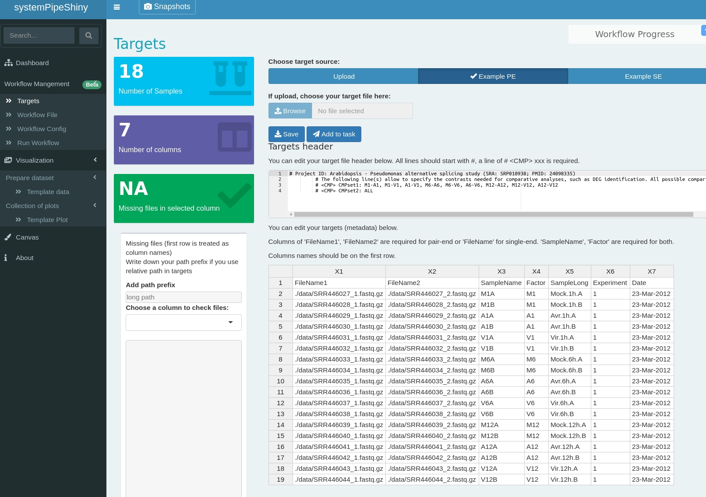
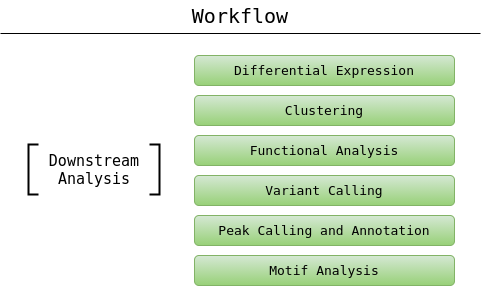
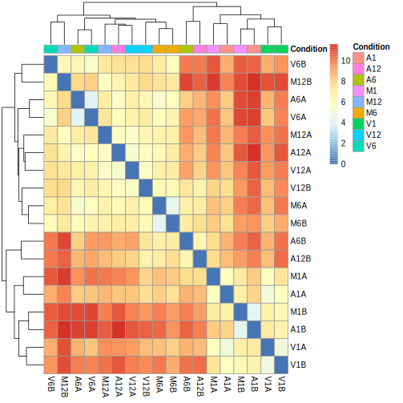
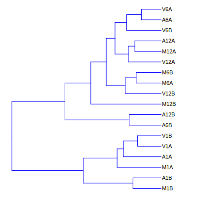
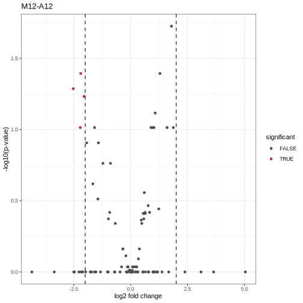
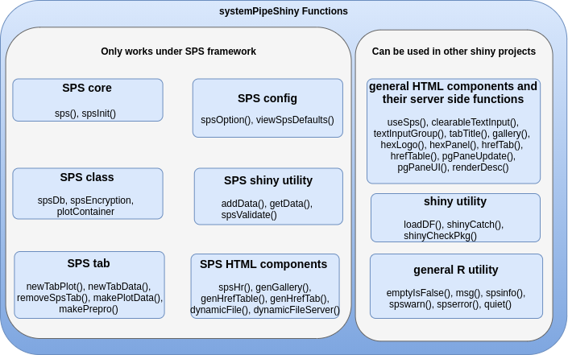
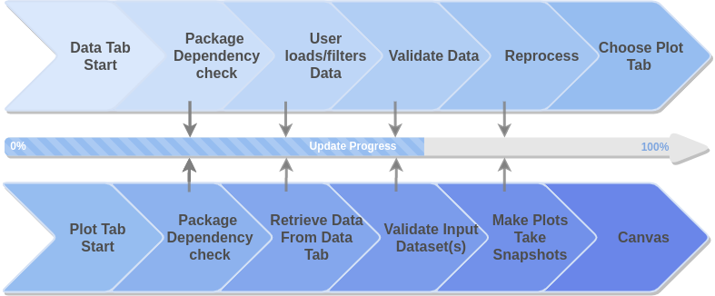
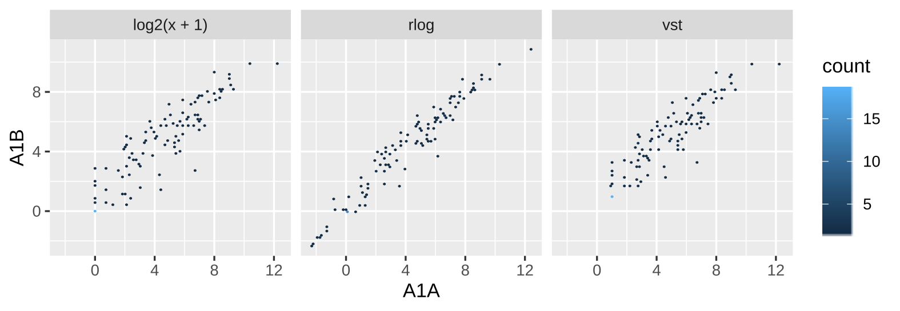
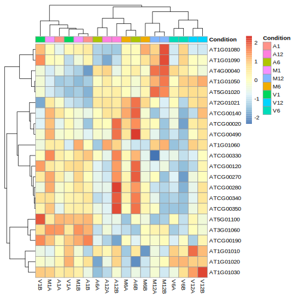

<!-- background-image: url(https://raw.githubusercontent.com/systemPipeR/systemPipeShiny/master/inst/app/www/img/sps_small.png) -->

layout: true
background-image: url(https://raw.githubusercontent.com/systemPipeR/systemPipeShiny/master/inst/app/www/img/sps_small.png)
background-position: 100% 0%
background-size: 10%


---
class: center, middle

## Outline

#### Introduction
#### *systemPipeShiny* Demo
#### Visualization Features
#### Customize and Extend
---
class: inverse, center, middle

# Introduction

---
## Motivation

<i class="fas fa-hand-point-right" style="color:#00758a;"></i> 
Build an interactive framework for workflow management and visualization by extending all [systemPipeR](https://systempipe.org/) functionalities

.pull-left[

]
.pull-right[

]

---
## Motivation

<i class="fas fa-hand-point-right" style="color:#00758a;"></i> 
Build an interactive framework for workflow management and visualization by extending all [systemPipeR](https://systempipe.org/) functionalities

.pull-left[

]
.pull-right[


]

---
## Motivation

<i class="fas fa-hand-point-right" style="color:#00758a;"></i> 
Build an interactive framework for workflow management and visualization by extending all [systemPipeR](https://systempipe.org/) functionalities

.pull-left[
.center[

]]
.pull-right[

<a href="#add link"></a>
]

---
## Motivation

<i class="fas fa-hand-point-right" style="color:#00758a;"></i> 
Build an interactive framework for workflow management and visualization by extending all [systemPipeR](https://systempipe.org/) functionalities

.pull-left[

]
.pull-right[


<a href="#heatMap"></a><a href="#cor"></a><a href="#pca"></a><a href="#volcano"></a><a href="#volcano"></a><a href="#logs"></a>
]

---
## Motivation

<i class="fas fa-hand-point-right" style="color:#00758a;"></i> 
Build an interactive framework for workflow management and visualization by extending all [systemPipeR](https://systempipe.org/) functionalities

.pull-left[

]
.pull-right[

]

---

## Motivation

<i class="fas fa-hand-point-right" style="color:#00758a;"></i> 
Build an interactive framework for workflow management and visualization by extending all [systemPipeR](https://systempipe.org/) functionalities

<i class="fas fa-hand-point-right" style="color:#00758a;"></i> 
Provide for non-R users, such as experimentalists, to run many systemPipeR’s workflow designs, control, and visualization functionalities interactively without requiring knowledge of R

<i class="fas fa-hand-point-right" style="color:#00758a;"></i>
Provide a tool that can be used on both local computers as well as centralized server-based deployments that can be accessed remotely as a public web service for using SPR’s functionalities with the community and/or private data


---
## <i class="fas fa-toolbox"></i> Features

.middle-slide[

]

???

<i class="fas fa-wrench" style="color:#00758a;"></i>
Interactively define experimental designs and provide associated metadata
using an easy to use tabular editor and/or file uploader

<i class="fas fa-wrench" style="color:#00758a;"></i>
visualize workflow topologies combined with auto-generation of R Markdown previews for
interactively designed workflows

<i class="fas fa-wrench" style="color:#00758a;"></i>
Allows prepare the data for the visualizations tabs


---
## <i class="fas fa-toolbox"></i> Structural Features

--

.left-column[
### User friendly
]

.right-column[
 
]

---

## <i class="fas fa-toolbox"></i> Structural Features

.left-column[
### User friendly
### Progress Tracking
]

.right-column[

 

]

---
## <i class="fas fa-toolbox"></i> Structural Features

.left-column[
### User friendly
### Progress Tracking
### Canvas 
]

.right-column[
Under this workbench users can take snapshots of different plots, and combine or resize them. This
feature is useful for generating complex scientific summary graphics.


]

---
## <i class="fas fa-toolbox"></i> Structural Features

.left-column[
### Progress Tracking
]

.right-column[
Messages, warnings and errors from R functions are automatically captured and logged on
both the server and client ends.


]

---
## <i class="fas fa-toolbox"></i> Structural Features

.left-column[
### Progress Tracking
### App Config
]

.right-column[
a robust exception handling system has been implemented (similar to Shiny options), that
provides error solutions to to users, e.g. invalid parameter settings.
]


---
## <i class="fas fa-toolbox"></i> Structural Features

.left-column[
### Progress Tracking
### App Config
### Modular Design
]

.right-column[
SPS is built on Shiny modules, which provides local scope isolation between each tab.
Objects on one tab do not conflict with other tabs. To enable cross-tab communication, SPS also supports
global scope interactions
]

---
## <i class="fas fa-bezier-curve"></i> Design 


---
## <i class="fas fa-user-edit"></i> Customize and Extend 

<i class="fas fa-wrench" style="color:#00758a;"></i>
Templates are available to generate new visualization tabs

 


---
class: inverse, center, middle

# <i class="fas fa-code"></i> Live Demo 

---
## <i class="fas fa-box-open"></i> Install Package

Install the **systemPipeShiny** package from [GitHub](https://github.com/systemPipeR/systemPipeShiny):


```r
if (!requireNamespace("BiocManager", quietly=TRUE))
    install.packages("BiocManager")
BiocManager::install("systemPipeR/systemPipeShiny", dependencies=TRUE, build_vignettes=TRUE)
```

### <i class="fas fa-book"></i> Load Package and Documentation

<i class="fas fa-question" style="color:#00758a;"></i> 
Load packages and accessing help


```r
library("systemPipeShiny")
```

<i class="fas fa-question" style="color:#00758a;"></i> 
Access help

```r
library(help="systemPipeShiny")
vignette("systemPipeShiny")
```

---
## <i class="fas fa-code"></i> Quick Start

Create the project:


```r
systemPipeShiny::spsInit()

## [SPS-INFO] 2020-08-30 17:03:28 Start to create a new SPS project
## [SPS-INFO] 2020-08-30 17:03:28 Create project under /home/dcassol/danielac@ucr.edu/projects/Presentations/SPS/SPS_20200830
## [SPS-INFO] 2020-08-30 17:03:28 Now copy files
## [SPS-INFO] 2020-08-30 17:03:28 Create SPS database
## [SPS-INFO] 2020-08-30 17:03:28 Created SPS database method container
## [SPS-INFO] 2020-08-30 17:03:28 Creating SPS db...
## [SPS-DANGER] 2020-08-30 17:03:28 Db created at '/home/dcassol/danielac@ucr.edu/projects/Presentations/SPS/SPS_20200830/config/sps.db'. DO NOT share this file with others
## [SPS-INFO] 2020-08-30 17:03:28 Key md5 dc17b12b7cadbb70e2d32a77bb32a17f
## [SPS-INFO] 2020-08-30 17:03:28 SPS project setup done!
```

---
## <i class="far fa-folder-open"></i> SPS Folder Structure

Directory structure:

```
SPS_YYYYMMDD
├── server.R
├── ui.R
├── global.R ## It will need manual input for new tabs
├── deploy.R ## Deploy helper file
├── config/ ## Folder with app configuration files
│   ├── sps.db             
│   ├── sps_options.yaml   
│   └── tabs.csv  
├── R/ ## All SPS additional tab files and helper R function files
│   └── tabs_xx.R 
├── data/ ## Storage all the input data
│   └── inputData 
├── results/ ## Storage all the results and plot data
│   └── plot_xx.png 
└── www/ ## Folder with all the app resources
```

---
## <i <i class="far fa-chart-bar"></i> Launching the interface

The `runApp` function from `shiny` package launches the app in our browser.


```r
shiny::runApp()
```

Check out our instance of **systemPipeShiny**: [Link](https://tgirke.shinyapps.io/systemPipeShiny/)

Note: Add iframe here

---
class: inverse, center, middle

# <i class="fas fa-code"></i> Visualization Features


---


### <i class="far fa-chart-bar"></i> Data transformations and visualization

.panelset[
.panel[.panel-name[Plot]

]

.panel[
.panel-name[
R Code
]

```r
targetspath <- system.file("extdata", "targets.txt", package = "systemPipeR")
targets <- read.delim(targetspath, comment = "#")
cmp <- systemPipeR::readComp(file = targetspath, format = "matrix", delim = "-")
countMatrixPath <- system.file("extdata", "countDFeByg.xls", package = "systemPipeR")
countMatrix <- read.delim(countMatrixPath, row.names = 1)
exploreDDSplot(countMatrix, targets, cmp = cmp[[1]], preFilter = NULL,
    samples = c(3, 4), savePlot = TRUE, filePlot = "transf.png")
```
]
]

---


### <i class="far fa-chart-bar"></i> Heatmap

.panelset[
.panel[.panel-name[Samples]

]

.panel[.panel-name[Individuals]

]

.panel[
.panel-name[R Code]
#### Samples


```r
exploredds <- exploreDDS(countMatrix, targets, cmp=cmp[[1]], preFilter=NULL, transformationMethod="rlog")
heatMaplot(exploredds, clust="samples")
heatMaplot(exploredds, clust="samples", plotly = TRUE)
```

#### Individuals genes identified in DEG analysis


```r
### DEG analysis with `systemPipeR`
degseqDF <- systemPipeR::run_DESeq2(countDF = countMatrix, targets = targets, cmp = cmp[[1]], independent = FALSE)
DEG_list <- systemPipeR::filterDEGs(degDF = degseqDF, filter = c(Fold = 2, FDR = 10))
heatMaplot(exploredds, clust="ind", DEGlist = unique(as.character(unlist(DEG_list[[1]]))))
heatMaplot(exploredds, clust="ind", DEGlist = unique(as.character(unlist(DEG_list[[1]]))), plotly = TRUE)
```

]]

---


### <i class="far fa-chart-bar"></i> Dendrogram

.panelset[
.panel[.panel-name[Plot]

]

.panel[
.panel-name[
R Code
]

```r
exploredds <- exploreDDS(countMatrix, targets, cmp=cmp[[1]], preFilter=NULL, transformationMethod="rlog")
hclustplot(exploredds, method = "spearman")
hclustplot(exploredds, method = "spearman", savePlot = TRUE, filePlot = "cor.pdf")
```
]
]

---


### <i class="far fa-chart-bar"></i> PCA plot

.panelset[
.panel[.panel-name[Plot plotly]


