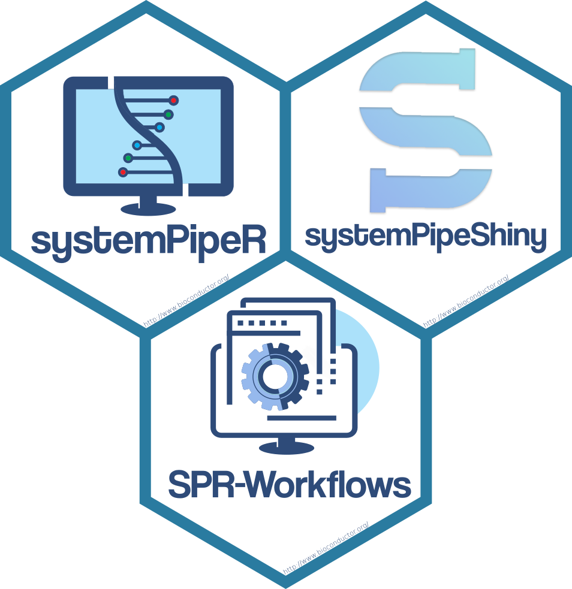

{}
[systemPipeR](https://systempipe.org/sp/) and [systemPipeShiny](https://systempipe.org/sps/) full documentation!
{}
 
 
systemPipe (SP) is a generic toolkit for designing and running reproducible data 
analysis workflows. The environment consists of three major modules implemented
as R/Bioconductor packages. 

- _systemPipeR_ (SPR) provides core functionalities for defining workflows, 
interacting with command-line software, and executing both R and/or command-line 
software, as well as generating publication-quality analysis reports. 

- _systemPipeShiny_ (SPS) integrates a graphical user interface for managing 
workflows and visualizing results interactively. 

- _systemPipeWorkflow_ (SPW) offers a collection of pre-configured workflow templates.

 ### Availability

All the packages are freely available for all common operating systems from
[Bioconductor](http://bioconductor.org/packages/systemPipeR). 

- _systemPipeR_ [Bioconductor](http://bioconductor.org/packages/systemPipeR) and [Github](https://github.com/tgirke/systemPipeR)

- _systemPipeShiny_ [Bioconductor](http://bioconductor.org/packages/release/bioc/html/systemPipeShiny.html) and [Github](https://github.com/systemPipeR/systemPipeShiny)

- _systemPipeWorkflow_ [Github](https://github.com/systemPipeR)

## Acknowledgement

This project is funded by NSF award [ABI-1661152](https://www.nsf.gov/awardsearch/showAward?AWD_ID=1661152).

