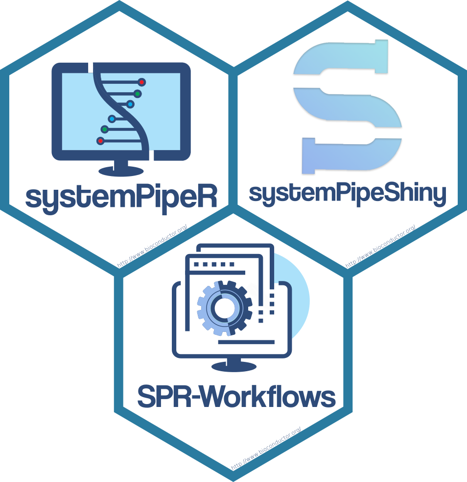

## Overview

The systemPipe project provides a suite of R/Bioconductor packages for designing, building, and executing end-to-end data analysis workflows on local machines and high-performance computing (HPC) systems, while simultaneously generating publication-quality analysis reports.

This website serves primarily as a landing page that provides a high-level overview of each package and links to their corresponding pages on Bioconductor. Detailed usage instructions, examples, and technical documentation are available in the package vignettes hosted on Bioconductor (linked below).

 

## Core Packages

  <h4 style="margin: 0;">systemPipeR: Workflow Management System (WMS)</h4>
  

 

[_systemPipeR_](https://bioconductor.org/packages/devel/bioc/html/systemPipeR.html) is the core workflow management package of the project. It enables users to define, organize, and execute workflows that integrate R-based analysis with external command-line software ([H Backman and Girke 2016](https://link.springer.com/article/10.1186/s12859-016-1241-0)). An automated scientific reporting framework is an integral component of the package, supporting reproducible and transparent analyses.

 

  <h4 style="margin: 0;">systemPipeRdata: Workflow Templates</h4>
  

 

[_systemPipeRdata_](https://www.bioconductor.org/packages/devel/data/experiment/html/systemPipeRdata.html) provides a collection of pre-configured workflow templates and associated resources that simplify the setup of common analysis pipelines and serve as starting points for reproducible workflow development.

 

  <h4 style="margin: 0;">systemPipeShiny: Visualization Toolbox</h4>
  

 

[_systemPipeShiny_](https://bioconductor.org/packages/release/bioc/html/systemPipeShiny.html) offers a Shiny-based graphical user interface for a subset of _systemPipeR_ functionalities, along with interactive visualization tools for result exploration, post-processing, and figure assembly.

## Workflow Templates 

The [_systemPipeRdata_](https://www.bioconductor.org/packages/release/data/experiment/html/systemPipeRdata.html) package supplies pre-configured workflow templates that are fully compatible with _systemPipeR_. These templates include CWL parameter files for command-line steps and, in many cases, example datasets. They are designed to:

  + reduce the learning curve,
  + facilitate rapid testing of workflows, and
  + provide modular building blocks for custom analyses.

Templates are available via _systemPipeRdata_ on Bioconductor and from the project’s GitHub repositories. The table below lists the core workflows and links for accessing them.

| **Name**   | **Description**                          | **URL**      |
|------------|------------------------------------------|--------------|
| new        | Generic Workflow Template                | [Bioc](https://www.bioconductor.org/packages/devel/data/experiment/vignettes/systemPipeRdata/inst/doc/new.html), [GitHub](https://github.com/systemPipeR/sprwf-new) |
| rnaseq     | RNA-Seq Workflow Template                | [Bioc](https://www.bioconductor.org/packages/devel/data/experiment/vignettes/systemPipeRdata/inst/doc/systemPipeRNAseq.html), [GitHub](https://github.com/systemPipeR/sprwf-rnaseq) |
| riboseq    | RIBO-Seq Workflow Template               | [Bioc](https://www.bioconductor.org/packages/devel/data/experiment/vignettes/systemPipeRdata/inst/doc/systemPipeRIBOseq.html), [GitHub](https://github.com/systemPipeR/sprwf-riboseq) |
| chipseq    | ChIP-Seq Workflow Template               | [Bioc](https://www.bioconductor.org/packages/devel/data/experiment/vignettes/systemPipeRdata/inst/doc/systemPipeChIPseq.html), [GitHub](https://github.com/systemPipeR/sprwf-chipseq) |
| varseq     | VAR-Seq Workflow Template                | [Bioc](https://www.bioconductor.org/packages/devel/data/experiment/vignettes/systemPipeRdata/inst/doc/systemPipeVARseq.html), [GitHub](https://github.com/systemPipeR/sprwf-varseq) |
| SPblast    | BLAST Workflow Template                  | [Bioc](https://www.bioconductor.org/packages/devel/data/experiment/vignettes/systemPipeRdata/inst/doc/SPblast.html), [GitHub](https://github.com/systemPipeR/sprwf-spblast) |
| SPcheminfo | Cheminformatics Drug Similarity Template | [Bioc](https://www.bioconductor.org/packages/devel/data/experiment/vignettes/systemPipeRdata/inst/doc/SPcheminfo.html), [GitHub](https://github.com/systemPipeR/sprwf-spcheminfo) |
| SPscrna    | Basic Single-Cell Workflow Template      | [Bioc](https://www.bioconductor.org/packages/devel/data/experiment/vignettes/systemPipeRdata/inst/doc/SPscrna.html), [GitHub](https://github.com/systemPipeR/sprwf-spscrna) |

Shared components used by some or all of the above workflows are given in this table. The `param` component is required for all workflows, while `data` is only used by some of them. 

| **Name**   | **Description**                          | **URL**      |
|------------|------------------------------------------|--------------|
| param      | CWL Parameter Files                      | [GitHub](https://github.com/systemPipeR/sprwfcmp-param) |
| data       | Small Test Datasets                      | [GitHub](https://github.com/systemPipeR/sprwfcmp-data) |

