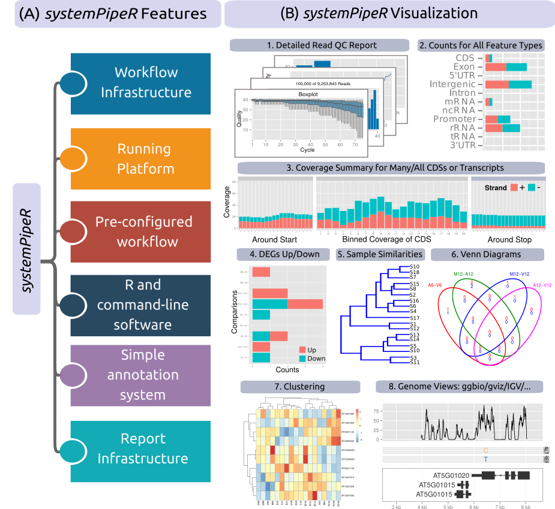

{}
Find [here](https://systempipe.org/spr/systempiper_vignette/) all the documentation!
{}

### Motivation

The analysis of Next-generation sequencing (NGS) data remains a 
major obstacle to the efficient utilization of the technology.  While
substantial effort has been invested on the development of software dedicated
to the individual analysis steps of NGS experiments, insufficient resources are
currently available for integrating the individual software components within
the widely used R/Bioconductor environment into automated workflows capable of
running the analysis of most types of NGS applications from start-to-finish in
a time-efficient and reproducible manner. 

### Results 

To address this need, we have developed the R/Bioconductor package
_systemPipeR_. It is an extensible environment for both building and
running end-to-end analysis workflows with automated report generation for a
wide range of NGS applications. Its unique features include a uniform workflow
interface across different NGS applications, automated report generation, and 
support for running both R and command-line software on local computers and
computer clusters. A flexible sample annotation infrastructure efficiently
handles complex sample sets and experimental designs.

To simplify the analysis
of widely used NGS applications, the package provides pre-configured workflows
and reporting templates for a wide range of NGS applications that are listed on 
the [Workflow Collection](https://systempipe.org/spr_wf/) 
page of this site. Additional workflow templates will be provided in the future. _systemPipeR_
accelerates the extraction of reproducible analysis results from NGS
experiments. By combining the capabilities of many R/Bioconductor and
command-line tools, it makes efficient use of existing software resources
without limiting the user to a set of predefined methods or environments. 

### Availability

_systemPipeR_ is freely available for all common operating systems from
[Bioconductor](http://bioconductor.org/packages/systemPipeR). Its GitHub 
repository is [here](https://github.com/tgirke/systemPipeR).

## Acknowledgement

This project is funded by NSF award [ABI-1661152](https://www.nsf.gov/awardsearch/showAward?AWD_ID=1661152).

