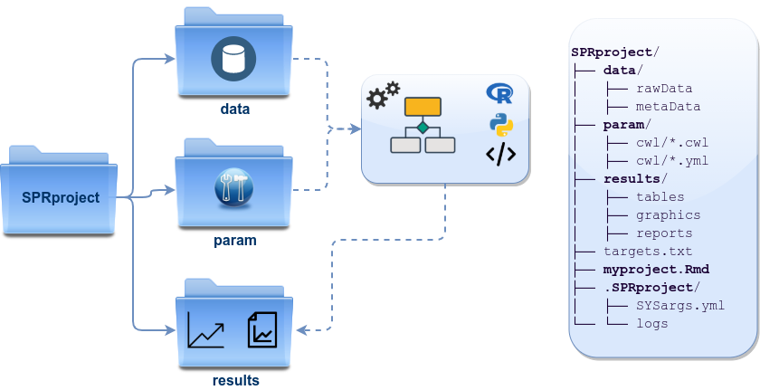
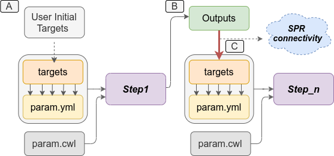

<!--
- Compile from command-line
Rscript -e "rmarkdown::render('systemPipeR.Rmd', c('BiocStyle::html_document'), clean=F); knitr::knit('systemPipeR.Rmd', tangle=TRUE)"; Rscript ../md2jekyll.R systemPipeR.knit.md 2; Rscript -e "rmarkdown::render('systemPipeR.Rmd', c('BiocStyle::pdf_document'))"
-->

```{r style, echo = FALSE, results = 'asis'}
BiocStyle::markdown()
options(width=80, max.print=1000)
knitr::opts_chunk$set(
    eval=as.logical(Sys.getenv("KNITR_EVAL", "TRUE")),
    cache=as.logical(Sys.getenv("KNITR_CACHE", "TRUE")), 
    tidy.opts=list(width.cutoff=80), tidy=TRUE)
```

```{r setup, echo=FALSE, message=FALSE, warning=FALSE}
suppressPackageStartupMessages({
    library(systemPipeR)
    library(BiocParallel)
    library(Biostrings)
    library(Rsamtools)
    library(GenomicRanges)
    library(ggplot2)
    library(GenomicAlignments)
    library(ShortRead)
    library(ape)
    library(batchtools)
    library(magrittr)
})
```

## Getting Started

### Installation

[_`systemPipeR`_](http://www.bioconductor.org/packages/devel/bioc/html/systemPipeR.html) 
environment can be installed from the R console using the [_`BiocManager::install`_](https://cran.r-project.org/web/packages/BiocManager/index.html) 
command. The associated data package [_`systemPipeRdata`_](http://www.bioconductor.org/packages/devel/data/experiment/html/systemPipeRdata.html) 
can be installed the same way. The latter is a helper package for generating _`systemPipeR`_ 
workflow environments with a single command containing all parameter files and 
sample data required to quickly test and run workflows. 

```{r install, eval=FALSE}
if (!requireNamespace("BiocManager", quietly=TRUE)) install.packages("BiocManager")
BiocManager::install("systemPipeR")
BiocManager::install("systemPipeRdata")
```

Please note that if you desire to use a third-party command-line tool, the particular
tool and dependencies need to be installed and exported in your PATH. 
See [details](#tools). 

### Loading package and documentation

```{r documentation, eval=FALSE}
library("systemPipeR") # Loads the package
library(help="systemPipeR") # Lists package info
vignette("systemPipeR") # Opens vignette
```

### How to get help for systemPipeR

All questions about the package or any particular function should be posted to 
the Bioconductor support site [https://support.bioconductor.org](https://support.bioconductor.org). 

Please add the "_`systemPipeR`_" tag to your question, and the package authors will 
automatically receive an alert. 

We appreciate receiving reports of bugs in the functions or documentation and
suggestions for improvement. For that, please consider opening an issue at
[GitHub](https://github.com/tgirke/systemPipeR/issues/new). 

## Project structure

_`systemPipeR`_ expects a project directory structure that consists of a directory
where users may store all the raw data, the results directory that will be reserved 
for all the outfiles files or new output folders, and the parameters directory. 

This structure allows reproducibility and collaboration across the data science 
team since internally relative paths are used. Users could transfer this project 
to a different location and still be able to run the entire workflow. Also, it 
increases efficiency and data management once the raw data is kept in a separate 
folder and avoids duplication. 

### Directory Structure {#dir}

[_`systemPipeRdata`_](http://bioconductor.org/packages/devel/data/experiment/html/systemPipeRdata.html), 
helper package, provides pre-configured workflows, reporting 
templates, and sample data loaded as demonstrated below. With a single command, 
the package allows creating the workflow environment containing the structure 
described here (see Figure \@ref(fig:dir)).

Directory names are indicated in <span style="color:grey">***green***</span>.
Users can change this structure as needed, but need to adjust the code in their 
workflows accordingly. 

* <span style="color:green">_**workflow/**_</span> (*e.g.* *myproject/*) 
    + This is the root directory of the R session running the workflow.
    + Run script ( *\*.Rmd*) and sample annotation (*targets.txt*) files are located here.
    + Note, this directory can have any name (*e.g.* <span style="color:green">_**myproject**_</span>). Changing its name does not require any modifications in the run script(s).
  + **Important subdirectories**: 
    + <span style="color:green">_**param/**_</span> 
        + <span style="color:green">_**param/cwl/**_</span>: This subdirectory stores all the parameter and configuration files. To organize workflows, each can have its own subdirectory, where all `*.cwl` and `*input.yml` files need to be in the same subdirectory. 
    + <span style="color:green">_**data/**_ </span>
        + Raw data (*e.g.* FASTQ files)
        + FASTA file of reference (*e.g.* reference genome)
        + Annotation files
        + Metadata
        + etc.
    + <span style="color:green">_**results/**_</span>
        + Analysis results are usually written to this directory, including: alignment, variant and peak files (BAM, VCF, BED); tabular result files; and image/plot files
        + Note, the user has the option to organize results files for a given sample and analysis step in a separate subdirectory.

```{r dir, eval=TRUE, echo=FALSE, out.width="100%", fig.align = "center", fig.cap= "*systemPipeR's* preconfigured directory structure."}
  
```

The following parameter files are included in each workflow template:

1. *`targets.txt`*: initial one provided by user; downstream *`targets_*.txt`* files are generated automatically
2. *`*.param/cwl`*: defines parameter for input/output file operations, *e.g.*:
    + *`hisat2/hisat2-mapping-se.cwl`* 
    + *`hisat2/hisat2-mapping-se.yml`*
3. *`*_run.sh`*: optional bash scripts 
4. Configuration files for computer cluster environments (skip on single machines):
    + *`.batchtools.conf.R`*: defines the type of scheduler for *`batchtools`* pointing to template file of cluster, and located in user's home directory
    + *`batchtools.*.tmpl`*: specifies parameters of scheduler used by a system, *e.g.* Torque, SGE, Slurm, etc.

### Structure of initial _`targets`_ file

The _`targets`_ file defines all input files (_e.g._ FASTQ, BAM, BCF) and sample 
comparisons of an analysis workflow. The following shows the format of a sample 
_`targets`_ file included in the package. It also can be viewed and downloaded 
from _`systemPipeR`_'s GitHub repository [here](https://github.com/tgirke/systemPipeR/blob/master/inst/extdata/targets.txt). 
In a target file with a single type of input files, here FASTQ files of 
single-end (SE) reads, the first column describe the path and the second column
represents a unique id name for each sample. The third column called `Factor` 
represents the biological replicates. All subsequent columns are additional 
information, and any number of extra columns can be added as needed.

Users should note here, the usage of targets files is optional when using
_`systemPipeR's`_ new workflow management interface. They can be replaced by a standard YAML
input file used by CWL. Since for organizing experimental variables targets
files are extremely useful and user-friendly. Thus, we encourage users to keep using 
them. 

#### Structure of _`targets`_ file for single-end (SE) samples

```{r targetsSE, eval=TRUE}
targetspath <- system.file("extdata", "targets.txt", package = "systemPipeR") 
showDF(read.delim(targetspath, comment.char = "#"))
```

To work with custom data, users need to generate a _`targets`_ file containing 
the paths to their own FASTQ files and then provide under _`targetspath`_ the
path to the corresponding _`targets`_ file. 

#### Structure of _`targets`_ file for paired-end (PE) samples

For paired-end (PE) samples, the structure of the targets file is similar, where
users need to provide two FASTQ path columns: *`FileName1`* and *`FileName2`* 
with the paths to the PE FASTQ files. 

```{r targetsPE, eval=TRUE}
targetspath <- system.file("extdata", "targetsPE.txt", package = "systemPipeR")
showDF(read.delim(targetspath, comment.char = "#"))
```

#### Structure of _`targets`_ file for "Hello World" example

In this example, _`targets`_ file presents only two columns, which the first one 
are the different phrases used by the `echo` command-line and the second column
it is the sample `id`. The `id` column is required, and each sample id should be unique. 

```{r targets_echo, eval=TRUE}
targetspath <- system.file("extdata/cwl/example/targets_example.txt", package = "systemPipeR")
showDF(read.delim(targetspath, comment.char = "#"))
```

#### Sample comparisons

Sample comparisons are defined in the header lines of the _`targets`_ file 
starting with '``# <CMP>``'. 

```{r comment_lines, echo=TRUE}
targetspath <- system.file("extdata", "targetsPE.txt", package = "systemPipeR")
readLines(targetspath)[1:4]
```

The function _`readComp`_ imports the comparison information and stores it in a 
_`list`_. Alternatively, _`readComp`_ can obtain the comparison information from 
the corresponding _`SYSargsList`_ step (see below). Note, these header lines are 
optional. They are mainly useful for controlling comparative analyses according 
to certain biological expectations, such as identifying differentially expressed
genes in RNA-Seq experiments based on simple pair-wise comparisons.
 
```{r targetscomp, eval=TRUE}
readComp(file = targetspath, format = "vector", delim = "-")
```

### Downstream targets files description

After the step which required the initial targets file information, the downstream 
targets files are created automatically (see Figure \@ref(fig:targetsFig)).
Each step that uses the previous step outfiles as an input, the new targets input 
will be managed internally by the workflow instances, establishing connectivity 
among the steps in the workflow. 
_`systemPipeR`_ provides features to automatically and systematically build this 
connection, providing security that all the samples will be managed efficiently 
and reproducibly.

```{r targetsFig, eval=TRUE, echo=FALSE, out.width="100%", fig.align = "center", fig.cap= "_`systemPipeR`_ automatically creates the downstream `targets` files based on the previous steps outfiles. A) Usually, users provide the initial `targets` files, and this step will generate some outfiles, as demonstrated on B. Then, those files are used to build the new `targets` files as inputs in the next step. _`systemPipeR`_ (C) manages this connectivity among the steps automatically for the users."}
  
```

## Structure of the new parameters files

The parameters and configuration required for running command-line software are 
provided by the widely used community standard [Common Workflow Language](https://www.commonwl.org/) (CWL) 
[@Amstutz2016-ka], which describes parameters analysis workflows in a generic 
and reproducible manner. For R-based workflow steps, param files are not required. 
For a complete overview of the CWL syntax, please see the [section](#cwl) below. 
Also, we have a dedicated section explain how to _`systemPipeR`_ establish the 
connection between the CWL parameters files and the targets files. Please see [here](#cwl_targets). 

```{r cleaning, eval=TRUE, include=FALSE}
if (file.exists(".SPRproject")) unlink(".SPRproject", recursive = TRUE)
## NOTE: Removing previous project create in the quick starts section
```

## References
