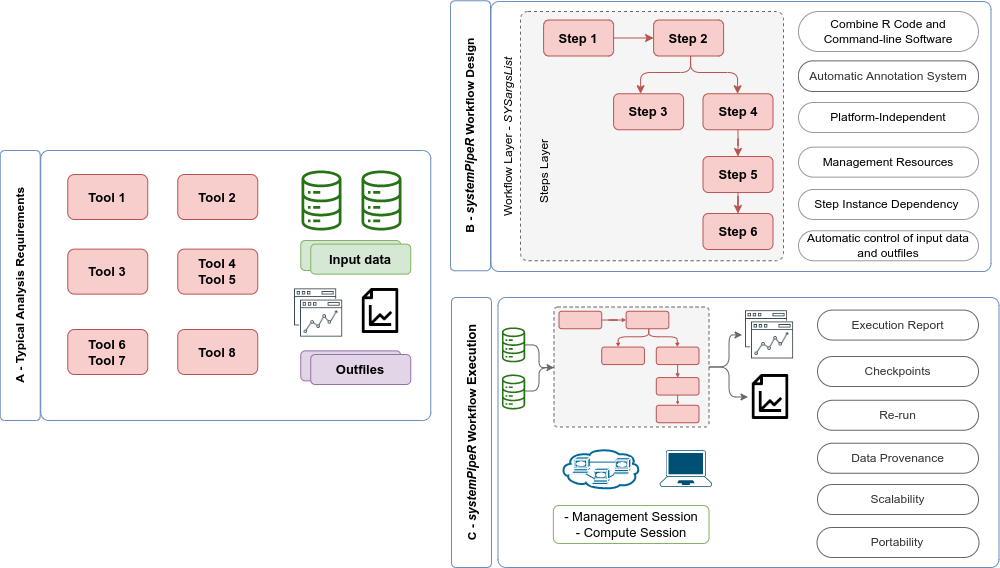
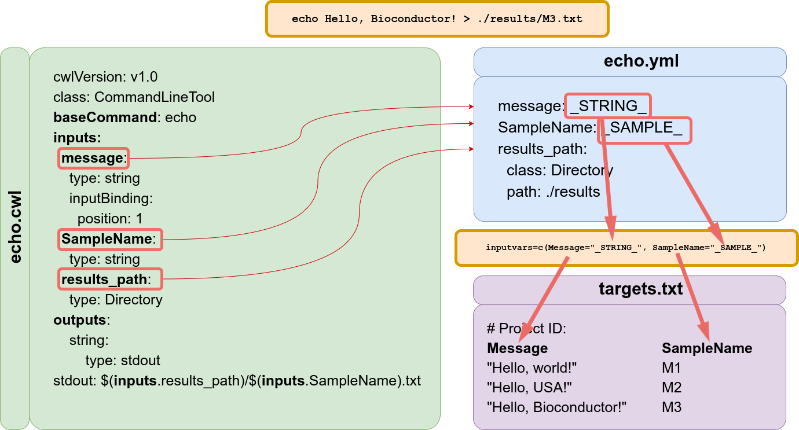

```{r style, echo = FALSE, results = 'asis'}
BiocStyle::markdown()
options(width=80, max.print=1000)
knitr::opts_chunk$set(
    eval=as.logical(Sys.getenv("KNITR_EVAL", "TRUE")),
    cache=as.logical(Sys.getenv("KNITR_CACHE", "TRUE")), 
    tidy.opts=list(width.cutoff=80), tidy=TRUE)
```

>**Note:** if you use _{`systemPipeR`}_ in published research, please cite:
>Backman, T.W.H and Girke, T. (2016). _systemPipeR_: NGS Workflow and Report Generation Environment. *BMC Bioinformatics*, 17: 388. >[10.1186/s12859-016-1241-0](https://doi.org/10.1186/s12859-016-1241-0).


[_`systemPipeR`_(SPR)](http://www.bioconductor.org/packages/devel/bioc/html/systemPipeR.html)
provides flexible utilities for designing, building and running automated end-to-end
analysis workflows for a wide range of research applications, including
next-generation sequencing (NGS) experiments, such as RNA-Seq, ChIP-Seq,
VAR-Seq and Ribo-Seq [@H_Backman2016-bt]. Important features include a uniform
workflow interface across different data analysis applications, automated
report generation, and support for running both R and command-line software,
such as NGS aligners or peak/variant callers, on local computers or compute
clusters (Figure \@ref(fig:utilities)). The latter supports interactive job submissions and batch submissions to queuing systems of clusters. 

_`systemPipeR`_ has been designed to improve the reproducibility of large-scale data
analysis projects while substantially reducing the time it takes to analyze 
complex omics data sets. It provides a uniform workflow interface and management
system that allows the users to run selected workflow steps, as well as customize and design entirely new workflows. Additionally, the package take advantage of central community S4 
classes of the Bioconductor ecosystem, and enhances them with command-line software support.

The main motivation and advantages of using _`systemPipeR`_ for complex data analysis tasks are:

1. Design of complex workflows involving multiple R/Bioconductor packages
2. Common workflow interface for different applications
3. User-friendly access to widely used Bioconductor utilities 
4. Support of command-line software from within R
5. Reduced complexity of using compute clusters from R 
6. Accelerated runtime of workflows via parallelization on computer systems with multiple CPU cores and/or multiple nodes
6. Improved reproducibility by automating the generation of analysis reports 

```{r utilities, eval=TRUE, warning= FALSE, echo=FALSE, out.width="100%", fig.align = "center", fig.cap= "Relevant features in `systemPipeR`. Workflow design concepts are illustrated under (A). Examples of `systemPipeR's` visualization functionalities are given under (B).", warning=FALSE}
knitr::include_graphics("utilities.png")
```

A central concept for designing workflows within the _`systemPipeR`_
environment is the use of workflow management containers. Workflow management
containers facilitate the design and execution of complex data
analysis steps. For its command-line interface _`systemPipeR`_ adopts the
widely used [Common Workflow Language](https://www.commonwl.org/) (CWL)
[@Amstutz2016-ka]. The interface to CWL is established by _`systemPipeR's`_
workflow control class called _`SYSargsList`_ (see Figure \@ref(fig:general)). This 
design offers many advantages such as: (i) options to run workflows either
entirely from within R, from various command-line wrappers (e.g., *cwl-runner*)
or from other languages (*, e.g.,* Bash or Python). Apart from providing
support for both command-line and R/Bioconductor software, the package provides
utilities for containerization, parallel evaluations on computer clusters and
automated generation of interactive analysis reports.

```{r general, warning= FALSE, eval=TRUE, echo=FALSE, out.width="100%", fig.align = "center", fig.cap= "Overview of `systemPipeR` workflows management instances. A) A typical analysis workflow requires multiple software tools (red), as well the description of the input (green) and output files, including analysis reports (purple). B) `systemPipeR` provides multiple utilities to design and build a workflow, allowing multi-instance, integration of R code and command-line software, a simple and efficient annotation system, that allows automatic control of the input and output data, and multiple resources to manage the entire workflow. c) Options are provided to execute single or multiple workflow steps, while enabling scalability, checkpoints, and generation of technical and scientific reports.",}


```

An important feature of _`systemPipeR's`_ CWL interface is that it provides two
options to run command-line tools and workflows based on CWL. First, one can
run CWL in its native way via an R-based wrapper utility for *cwl-runner* or
*cwl-tools* (CWL-based approach). Second, one can run workflows using CWL's
command-line and workflow instructions from within R (R-based approach). In the
latter case the same CWL workflow definition files (*e.g.* `*.cwl` and `*.yml`)
are used but rendered and executed entirely with R functions defined by
_`systemPipeR`_, and thus use CWL mainly as a command-line and workflow
definition format rather than execution software to run workflows. In this regard
_`systemPipeR`_ also provides several convenience functions that are useful for
designing and debugging workflows, such as a command-line rendering function to
retrieve the exact command-line strings for each data set and processing step
prior to running a command-line.

## Workflow Management with _`SYSargsList`_ 

The `SYSargsList` S4 class is a list-like container that stores the paths to
all input and output files along with the corresponding parameters used in each
analysis step (see Figure \@ref(fig:sysargslistImage)). `SYSargsList` instances are constructed from an
optional targets files, and two CWL parameter files including `*.cwl` and
`*.yml` (for details, see below). When running preconfigured NGS workflows, the
only input the user needs to provide is the initial targets file containing the
paths to the input files (e.g., FASTQ) and experiment design information, such
as sample labels and biological replicates. Subsequent targets instances are
created automatically, based on the connectivity establish between each
workflow step. _`SYSargsList`_ containers store all information required for
one or multiple steps. This establishes central control for running, monitoring
and debugging complex workflows from start to finish. 


Workflow steps with input/output file operations are controlled by the _`SYSargsList`_ container. Each of its components (_`SYSargs2`_) are constructed from an optional *targets* and two *param* files. Alternatively, _`LineWise`_ instances containing pure R code can be used.

## Command-line software support

_`systemPipeR`_ adopted the widely used community standard Common Workflow 
Language (CWL) [@Amstutz2016-ka] for describing command-line tools and workflows
in a declarative, generic, and reproducible manner. CWL specifications are 
text-based files and can be structured using YAML (https://yaml.org/) syntax. 
Therefore, the description files can be easily accessed and are readable. 
The significant advantage of adopting CWL as a standard description of 
command-line tools within \textit{systemPipeR} is the flexibility of workflow 
reusability for different computing environments and workflow frameworks in the 
community, improving reproducibility, portability, and shareability between
collaborators and community.

Following the CWL Command Line Tool Description Specification 
(https://www.commonwl.org/v1.2/CommandLineTool.html), the basic elements of the 
CWL tool description are defined in two files. Figure \@ref(fig:sprandCWL)A-B illustrate 
the “hello world” example. The main file contains all the information necessary 
to build the command-line that will be executed, specifying the input, expected
output files, and arguments for the command-line (Figure \@ref(fig:sprandCWL)A). 
The second file is optional yet provides flexibility to assign values to 
parameters required to make the input or output objects when building the command-line. 

```{r sprandCWL, warning=FALSE, eval=TRUE, echo=FALSE, out.width="100%", fig.align = "center", fig.cap= "Example of 'Hello World' message using CWL syntax and demonstrating the connectivity with `systemPipeR`. (A) This file describes the command-line tool, here using 'echo' command. (B) This file describes all the parameters variables connected with the tool specification file. Here the reference value of the input parameter can be specific or can be filled dynamically, adding a variable that connects with the targets files from `systemPipeR`. (C) `SYSargsList` function provides the 'inputvars' arguments to build the connectivity between the CWL description of parameters and the targets files. The argument requires a named vector where each vector element is required to be defined in the CWL description of parameters file (B), and the names of the elements are needed to match the column names defined in the targets file (D)."}


```
### Reference
