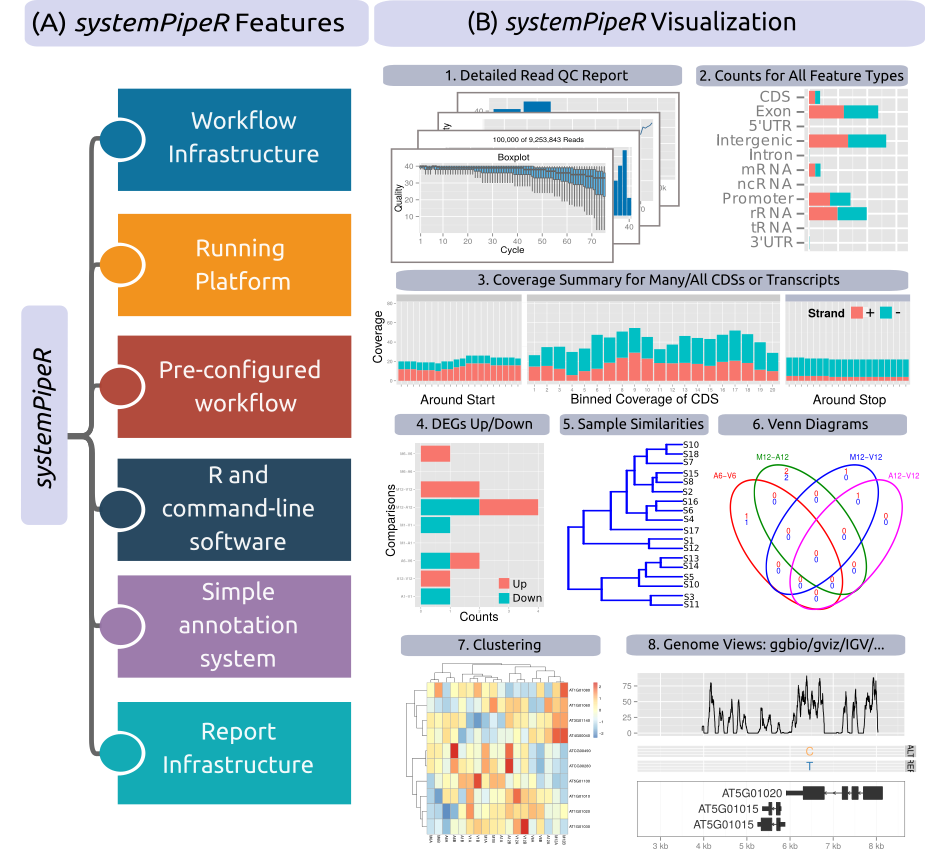
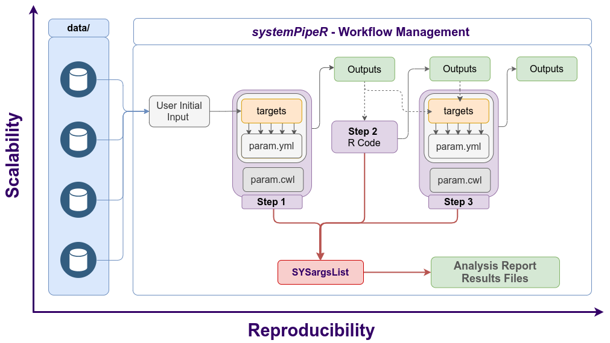

<!--
- Compile from command-line
Rscript -e "rmarkdown::render('systemPipeR.Rmd', c('BiocStyle::html_document'), clean=F); knitr::knit('systemPipeR.Rmd', tangle=TRUE)"; Rscript ../md2jekyll.R systemPipeR.knit.md 2; Rscript -e "rmarkdown::render('systemPipeR.Rmd', c('BiocStyle::pdf_document'))"
-->

```{r style, echo = FALSE, results = 'asis'}
BiocStyle::markdown()
options(width=80, max.print=1000)
knitr::opts_chunk$set(
    eval=as.logical(Sys.getenv("KNITR_EVAL", "TRUE")),
    cache=as.logical(Sys.getenv("KNITR_CACHE", "TRUE")), 
    tidy.opts=list(width.cutoff=80), tidy=TRUE)
```

```{r setup, echo=FALSE, message=FALSE, warning=FALSE}
suppressPackageStartupMessages({
    library(systemPipeR)
    library(BiocParallel)
    library(Biostrings)
    library(Rsamtools)
    library(GenomicRanges)
    library(ggplot2)
    library(GenomicAlignments)
    library(ShortRead)
    library(ape)
    library(batchtools)
    library(magrittr)
})
```

**Note:** if you use _`systemPipeR`_ in published research, please cite:
Backman, T.W.H and Girke, T. (2016). _`systemPipeR`_: NGS Workflow and Report Generation Environment. *BMC Bioinformatics*, 17: 388. [10.1186/s12859-016-1241-0](https://doi.org/10.1186/s12859-016-1241-0).

# Introduction

[_`systemPipeR`_](http://www.bioconductor.org/packages/devel/bioc/html/systemPipeR.html) 
provides flexible utilities for designing, building, and running automated nd-to-end analysis 
workflows for a wide range of research applications, including next-generation 
sequencing (NGS) experiments [@H_Backman2016-bt]. Important features include a 
uniform workflow interface across different data analysis applications, automated 
report generation, and support for running both R and command-line software, 
on local computers or compute clusters (see Figure \@ref(fig:utilities)).
The latter supports interactive job submissions and batch submissions to queuing 
systems of clusters. 

It has been designed to improve the reproducibility of large-scale data analysis 
projects while substantially reducing the time it takes to analyze complex omics
data sets. Its unique features include a uniform workflow interface and management 
system that allows the user to run selected steps, customize, and design entirely
new workflows. Also, the package features take advantage of central community S4 
classes of the Bioconductor ecosystem and command-line-based software support.

The main motivation and advantages of using _`systemPipeR`_ for complex data analysis tasks are:

1. Facilitates the design of complex workflows involving multiple R/Bioconductor packages
2. Common workflow interface for different applications
3. Makes analysis with Bioconductor utilities more accessible to new users
4. Simplifies usage of command-line software from within R
5. Reduces the complexity of using compute clusters for R and command-line software
6. Accelerates runtime of workflows via parallelization on computer systems with multiple CPU cores and/or multiple compute nodes
6. Improves reproducibility by automating analyses and generation of analysis reports 

```{r utilities, eval=TRUE, echo=FALSE, out.width="100%", fig.align = "center", fig.cap= "Relevant features in `systemPipeR`. Workflow design concepts are illustrated under (A & B). Examples of *systemPipeR's* visualization functionalities are given under (C)."}

```

A central concept for designing workflows within the _`systemPipeR`_ environment 
is the use of workflow management containers. 
Workflow management containers allow the automation of design, build, run and 
scale different steps and tools in data analysis.
_`systemPipeR`_ adopted the widely used community standard [Common Workflow Language](https://www.commonwl.org/) (CWL) 
[@Amstutz2016-ka] for describing parameters analysis workflows in a generic and reproducible 
manner. Using this community standard in _`systemPipeR`_
has many advantages. For instance, the integration of CWL allows running _`systemPipeR`_
workflows from a single specification instance either entirely from within R, from various command-line wrappers (e.g., *cwl-runner*) or from other languages (*, e.g.,* Bash or Python).
_`systemPipeR`_ includes support for both command-line and R/Bioconductor software 
as well as resources for containerization, parallel evaluations on computer clusters 
along with the automated generation of interactive analysis reports.

An important feature of _`systemPipeR's`_ CWL interface is that it provides two
options to run command-line tools and workflows based on CWL. First, one can
run CWL in its native way via an R-based wrapper utility for *cwl-runner* or
*cwl-tools* (CWL-based approach). Second, one can run workflows using CWL's
command-line and workflow instructions from within R (R-based approach). In the
latter case the same CWL workflow definition files (*e.g.* `*.cwl` and `*.yml`)
are used but rendered and executed entirely with R functions defined by
_`systemPipeR`_, and thus use CWL mainly as a command-line and workflow
definition format rather than software to run workflows. In this regard
_`systemPipeR`_ also provides several convenience functions that are useful for
designing and debugging workflows, such as a command-line rendering function to
retrieve the exact command-line strings for each data set and processing step
prior to running a command-line.

This overview introduces the design of a workflow management container, an S4 
class in _`systemPipeR`_, as well as the custom command-line interface, 
combined with the overview of all the common analysis steps of NGS experiments.

## New workflow management interface

_`systemPipeR`_ allows creation (multi-step analyses) and execution of workflow 
entirely for R, with control, flexibility, and scalability of the all process. 
The execution of the workflow can be sent to a HPC, can be parallelizes, 
accelerating results acquisition. 

The flexibility of _`systemPipeR's`_ new interface workflow management class is
the driving factor behind the use of as many steps necessary for the analysis,
as well as the connection between command-line- or R-based software. The
connectivity among all workflow steps is achieved by the `SYSargsList` workflow
management class.

`SYSargsList` S4 class is a list-like container where each instance stores all the
input/output paths and parameter components required for a particular data
analysis step (see Figure \@ref(fig:sysargslistImage)).

The `SYSargsList` constructor function will generate the instances, using as data 
input initial targets files, as well as two-parameter files (for details, see below).
When running preconfigured workflows, the only input the user needs to provide 
is the initial targets file containing the paths to the input files (e.g., FASTQ) 
along with unique sample labels. Subsequent targets instances are created 
automatically, based on the connectivity establish between the steps. The 
parameters required for running command-line software is provided by the 
parameter (`*.cwl` and `*.yml`)) files described below.

The class store one or multiple steps, allowing central control for running, 
checking status, and monitor complex workflows from start to finish. This design 
enhances the systemPipeR workflow framework with a generalized, flexible, and 
robust design.

```{r sysargslistImage, eval=TRUE, echo=FALSE, out.width="100%", fig.align = "center", fig.cap= "Workflow steps with input/output file operations are controlled by `SYSargs2` objects. Each `SYSargs2`instance is constructed from one targets and two param files. The only input provided by the user is the initial targets file. Subsequent targets instances are created automatically, from the previous output files. Any number of predefined or custom workflow steps are supported. One or many `SYSargs2` objects are organized in an `SYSargsList` container."}


```

### Reference
