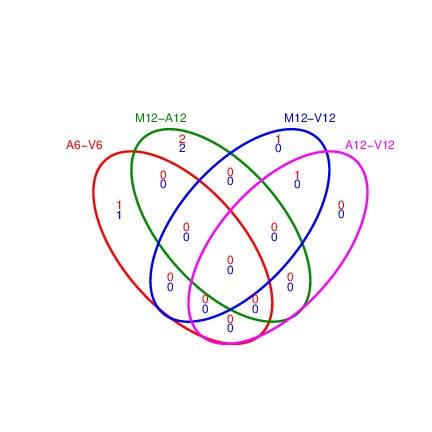

<script src="/rmarkdown-libs/htmlwidgets/htmlwidgets.js"></script>
<link href="/rmarkdown-libs/vizjs/plotwf.css" rel="stylesheet" />
<script src="/rmarkdown-libs/vizjs/viz.js"></script>
<script src="/rmarkdown-libs/vizjs/full.render.js"></script>
<script src="/rmarkdown-libs/dom_to_image/dom_to_image.js"></script>
<link id="plotwf_legend-1-attachment" rel="attachment" href="steps_files/plotwf_legend/plotwf_legend.svg"/>
<script src="/rmarkdown-libs/plotwf-binding/plotwf.js"></script>
<script type="text/javascript">
document.addEventListener("DOMContentLoaded", function() {
  document.querySelector("h1").className = "title";
});
</script>
<script type="text/javascript">
document.addEventListener("DOMContentLoaded", function() {
  var links = document.links;  
  for (var i = 0, linksLength = links.length; i < linksLength; i++)
    if (links[i].hostname != window.location.hostname)
      links[i].target = '_blank';
});
</script>

## Define environment settings and samples

A typical workflow starts with generating the expected working environment
containing the proper directory structure, input files, and parameter settings.
To simplify this task, one can load one of the existing NGS workflows templates
provided by *`systemPipeRdata`* into the current working directory. The
following does this for the *`rnaseq`* template. The name of the resulting
workflow directory can be specified under the *`mydirname`* argument. The
default *`NULL`* uses the name of the chosen workflow. An error is issued if a
directory of the same name and path exists already. On Linux and OS X systems
one can also create new workflow instances from the command-line of a terminal as shown
[here](http://bioconductor.org/packages/devel/data/experiment/vignettes/systemPipeRdata/inst/doc/systemPipeRdata.html#generate-workflow-template).
To apply workflows to custom data, the user needs to modify the *`targets`* file and if
necessary update the corresponding *`.cwl`* and *`.yml`* files. A collection of pre-generated *`.cwl`* and *`.yml`* files are provided in the *`param/cwl`* subdirectory of each workflow template. They
are also viewable in the GitHub repository of *`systemPipeRdata`* ([see
here](https://github.com/tgirke/systemPipeRdata/tree/master/inst/extdata/param)).

``` r
library(systemPipeR)
library(systemPipeRdata)
genWorkenvir(workflow = "rnaseq", mydirname = NULL)
```

    ## [1] "Generated rnaseq directory. Next run in rnaseq directory, the R code from *.Rmd template interactively. Alternatively, workflows can be exectued with a single command as instructed in the vignette."

``` r
setwd("rnaseq")
```

## Project initialization

To create a Workflow within *`systemPipeR`*, we can start by defining an empty
container and checking the directory structure:

``` r
sal <- SPRproject()
```

    ## Creating directory '/home/dcassol/danielac@ucr.edu/projects/SP/SPR_org/newdeploy/systemPipeR.github.io/content/en/sp/spr/rnaseq/.SPRproject'
    ## Creating file '/home/dcassol/danielac@ucr.edu/projects/SP/SPR_org/newdeploy/systemPipeR.github.io/content/en/sp/spr/rnaseq/.SPRproject/SYSargsList.yml'

### Required packages and resources

The `systemPipeR` package needs to be loaded (H Backman and Girke 2016).

``` r
appendStep(sal) <- LineWise({
    library(systemPipeR)
}, step_name = "load_SPR")
```

## Read Preprocessing

### Preprocessing with *`preprocessReads`* function

The function *`preprocessReads`* allows to apply predefined or custom
read preprocessing functions to all FASTQ files referenced in a
*`SYSargsList`* container, such as quality filtering or adaptor trimming
routines. Internally, *`preprocessReads`* uses the *`FastqStreamer`* function from
the *`ShortRead`* package to stream through large FASTQ files in a
memory-efficient manner. The following example performs adaptor trimming with
the *`trimLRPatterns`* function from the *`Biostrings`* package.

Here, we are appending this step at the *`SYSargsList`* object created previously.
All the parameters are defined on the *`preprocessReads/preprocessReads-se.yml`* file.

``` r
targetspath <- system.file("extdata", "targets.txt", package = "systemPipeR")
appendStep(sal) <- SYSargsList(step_name = "preprocessing", targets = targetspath,
    dir = TRUE, wf_file = "preprocessReads/preprocessReads-se.cwl", input_file = "preprocessReads/preprocessReads-se.yml",
    dir_path = system.file("extdata/cwl", package = "systemPipeR"), inputvars = c(FileName = "_FASTQ_PATH1_",
        SampleName = "_SampleName_"), dependency = "load_SPR")
```

The paths to the resulting output FASTQ files can be checked as follows:

``` r
outfiles(sal)[[2]]
```

    ## DataFrame with 18 rows and 1 column
    ##         preprocessReads_se
    ##                <character>
    ## 1   ./results/M1A.fastq_..
    ## 2   ./results/M1B.fastq_..
    ## 3   ./results/A1A.fastq_..
    ## 4   ./results/A1B.fastq_..
    ## 5   ./results/V1A.fastq_..
    ## ...                    ...
    ## 14  ./results/M12B.fastq..
    ## 15  ./results/A12A.fastq..
    ## 16  ./results/A12B.fastq..
    ## 17  ./results/V12A.fastq..
    ## 18  ./results/V12B.fastq..

After the trimming step a new targets file is generated containing the paths to
the trimmed FASTQ files. The new targets information can be used for the next workflow
step instance, *e.g.* running the NGS alignments with the trimmed FASTQ files.

The following example shows how one can design a custom read preprocessing function
using utilities provided by the *`ShortRead`* package, and then run it
in batch mode with the *‘preprocessReads’* function. For here, it is possible to
replace the function used on the `preprocessing` step and modify the `sal` object.
First, we defined the function:

``` r
appendStep(sal) <- LineWise({
    filterFct <- function(fq, cutoff = 20, Nexceptions = 0) {
        qcount <- rowSums(as(quality(fq), "matrix") <= cutoff, na.rm = TRUE)
        # Retains reads where Phred scores are >= cutoff with N exceptions
        fq[qcount <= Nexceptions]
    }
}, step_name = "custom_preprocessing_function", dependency = "preprocessing")
```

After, we can edit the input parameter:

``` r
yamlinput(sal, 2)$Fct
yamlinput(sal, 2, "Fct") <- "'filterFct(fq, cutoff=20, Nexceptions=0)'"
yamlinput(sal, 2)$Fct  ## check the new function
```

### Preprocessing with TrimGalore!

[TrimGalore!](http://www.bioinformatics.babraham.ac.uk/projects/trim_galore/) is
a wrapper tool to consistently apply quality and adapter trimming to fastq files,
with some extra functionality for removing Reduced Representation Bisulfite-Seq
(RRBS) libraries.

``` r
targetspath <- system.file("extdata", "targets.txt", package = "systemPipeR")
appendStep(sal) <- SYSargsList(step_name = "trimGalore", targets = targetspath, dir = TRUE,
    wf_file = "trim_galore/trim_galore-se.cwl", input_file = "trim_galore/trim_galore-se.yml",
    dir_path = system.file("extdata/cwl", package = "systemPipeR"), inputvars = c(FileName = "_FASTQ_PATH1_",
        SampleName = "_SampleName_"), dependency = "load_SPR", run_step = "optional")
```

### Preprocessing with Trimmomatic

``` r
targetspath <- system.file("extdata", "targets.txt", package = "systemPipeR")
appendStep(sal) <- SYSargsList(step_name = "trimmomatic", targets = targetspath,
    dir = TRUE, wf_file = "trimmomatic/trimmomatic-se.cwl", input_file = "trimmomatic/trimmomatic-se.yml",
    dir_path = system.file("extdata/cwl", package = "systemPipeR"), inputvars = c(FileName = "_FASTQ_PATH1_",
        SampleName = "_SampleName_"), dependency = "load_SPR", run_step = "optional")
```

## FASTQ quality report

The following *`seeFastq`* and *`seeFastqPlot`* functions generate and plot a series of
useful quality statistics for a set of FASTQ files including per cycle quality
box plots, base proportions, base-level quality trends, relative k-mer
diversity, length and occurrence distribution of reads, number of reads above
quality cutoffs and mean quality distribution.  
The function *`seeFastq`* computes the quality statistics and stores the results in a
relatively small list object that can be saved to disk with *`save()`* and
reloaded with *`load()`* for later plotting. The argument *`klength`* specifies the
k-mer length and *`batchsize`* the number of reads to a random sample from each
FASTQ file.

``` r
appendStep(sal) <- LineWise({
    files <- getColumn(sal, step = "preprocessing", "outfiles")  # get outfiles from preprocessing step
    fqlist <- seeFastq(fastq = files, batchsize = 10000, klength = 8)
    pdf("./results/fastqReport.pdf", height = 18, width = 4 * length(fqlist))
    seeFastqPlot(fqlist)
    dev.off()
}, step_name = "fastq_quality", dependency = "preprocessing")
```

<center>

</center>

<div align="center">

**Figure 1:** FASTQ quality report

</div>

</br>

Parallelization of FASTQ quality report on a single machine with multiple cores.

``` r
appendStep(sal) <- LineWise({
    files <- getColumn(sal, step = "preprocessing", "outfiles")  # get outfiles from preprocessing step
    f <- function(x) seeFastq(fastq = files[x], batchsize = 1e+05, klength = 8)
    fqlist <- bplapply(seq(along = files), f, BPPARAM = MulticoreParam(workers = 4))  ## Number of workers = 4
    pdf("./results/fastqReport.pdf", height = 18, width = 4 * length(fqlist))
    seeFastqPlot(unlist(fqlist, recursive = FALSE))
    dev.off()
}, step_name = "fastq_quality", dependency = "preprocessing")
```

## NGS Alignment software

After quality control, the sequence reads can be aligned to a reference genome or
transcriptome database. The following sessions present some NGS sequence alignment
software. Select the most accurate aligner and determining the optimal parameter
for your custom data set project.

For all the following examples, it is necessary to install the respective software
and export the `PATH` accordingly. If it is available [Environment Module](http://modules.sourceforge.net/)
in the system, you can load all the request software with *`moduleload(args)`* function.

### Alignment with `HISAT2`

The following steps will demonstrate how to use the short read aligner `Hisat2`
(Kim, Langmead, and Salzberg 2015) in both interactive job submissions and batch submissions to
queuing systems of clusters using the *`systemPipeR's`* new CWL command-line interface.

-   Build `Hisat2` index.

``` r
appendStep(sal) <- SYSargsList(step_name = "hisat_index", targets = NULL, dir = FALSE,
    wf_file = "hisat2/hisat2-index.cwl", input_file = "hisat2/hisat2-index.yml",
    dir_path = system.file("extdata/cwl", package = "systemPipeR"), inputvars = NULL,
    dependency = "preprocessing")
```

The parameter settings of the aligner are defined in the `workflow_hisat2-se.cwl`
and `workflow_hisat2-se.yml` files. The following shows how to construct the
corresponding *SYSargsList* object, and append to *sal* workflow.

-   Alignment with `HISAT2` and `SAMtools`

It possible to build an workflow with `HISAT2` and `SAMtools`.

``` r
appendStep(sal) <- SYSargsList(step_name = "hisat_mapping", targets = "preprocessing",
    dir = TRUE, wf_file = "workflow-hisat2/workflow_hisat2-se.cwl", input_file = "workflow-hisat2/workflow_hisat2-se.yml",
    dir_path = system.file("extdata/cwl", package = "systemPipeR"), inputvars = c(preprocessReads_se = "_FASTQ_PATH1_",
        SampleName = "_SampleName_"), dependency = c("hisat_index"), run_session = "remote")
```

### Alignment with `Tophat2`

The NGS reads of this project can also be aligned against the reference genome
sequence using `Bowtie2/TopHat2` (Kim et al. 2013; Langmead and Salzberg 2012).

-   Build *`Bowtie2`* index.

``` r
appendStep(sal) <- SYSargsList(step_name = "bowtie_index", targets = NULL, dir = FALSE,
    wf_file = "bowtie2/bowtie2-index.cwl", input_file = "bowtie2/bowtie2-index.yml",
    dir_path = system.file("extdata/cwl", package = "systemPipeR"), inputvars = NULL,
    dependency = "preprocessing", run_step = "optional")
```

The parameter settings of the aligner are defined in the `workflow_tophat2-mapping.cwl`
and `tophat2-mapping-pe.yml` files. The following shows how to construct the
corresponding *SYSargsList* object, using the outfiles from the `preprocessing` step.

``` r
appendStep(sal) <- SYSargsList(step_name = "tophat2_mapping", targets = "preprocessing",
    dir = TRUE, wf_file = "tophat2/workflow_tophat2-mapping-se.cwl", input_file = "tophat2/tophat2-mapping-se.yml",
    dir_path = system.file("extdata/cwl", package = "systemPipeR"), inputvars = c(preprocessReads_se = "_FASTQ_PATH1_",
        SampleName = "_SampleName_"), dependency = c("bowtie_index"), run_session = "remote",
    run_step = "optional")
```

### Alignment with *`Bowtie2`* (*e.g.* for miRNA profiling)

The following example runs *`Bowtie2`* as a single process without submitting it to a cluster.

``` r
appendStep(sal) <- SYSargsList(step_name = "bowtie2_mapping", targets = "preprocessing",
    dir = TRUE, wf_file = "bowtie2/workflow_bowtie2-mapping-se.cwl", input_file = "bowtie2/bowtie2-mapping-se.yml",
    dir_path = system.file("extdata/cwl", package = "systemPipeR"), inputvars = c(preprocessReads_se = "_FASTQ_PATH1_",
        SampleName = "_SampleName_"), dependency = c("bowtie_index"), run_session = "remote",
    run_step = "optional")
```

### Alignment with *`BWA-MEM`* (*e.g.* for VAR-Seq)

The following example runs BWA-MEM as a single process without submitting it to a cluster.

-   Build the index:

``` r
appendStep(sal) <- SYSargsList(step_name = "bwa_index", targets = NULL, dir = FALSE,
    wf_file = "bwa/bwa-index.cwl", input_file = "bwa/bwa-index.yml", dir_path = system.file("extdata/cwl",
        package = "systemPipeR"), inputvars = NULL, dependency = "preprocessing",
    run_step = "optional")
```

-   Prepare the alignment step:

``` r
appendStep(sal) <- SYSargsList(step_name = "bwa_mapping", targets = "preprocessing",
    dir = TRUE, wf_file = "bwa/bwa-se.cwl", input_file = "bwa/bwa-se.yml", dir_path = system.file("extdata/cwl",
        package = "systemPipeR"), inputvars = c(preprocessReads_se = "_FASTQ_PATH1_",
        SampleName = "_SampleName_"), dependency = c("bwa_index"), run_session = "remote",
    run_step = "optional")
```

### Alignment with *`Rsubread`* (*e.g.* for RNA-Seq)

The following example shows how one can use within the environment the R-based aligner , allowing running from R or command-line.

-   Build the index:

``` r
appendStep(sal) <- SYSargsList(step_name = "rsubread_index", targets = NULL, dir = FALSE,
    wf_file = "rsubread/rsubread-index.cwl", input_file = "rsubread/rsubread-index.yml",
    dir_path = system.file("extdata/cwl", package = "systemPipeR"), inputvars = NULL,
    dependency = "preprocessing", run_step = "optional")
```

-   Prepare the alignment step:

``` r
appendStep(sal) <- SYSargsList(step_name = "rsubread", targets = "preprocessing",
    dir = TRUE, wf_file = "rsubread/rsubread-mapping-se.cwl", input_file = "rsubread/rsubread-mapping-se.yml",
    dir_path = system.file("extdata/cwl", package = "systemPipeR"), inputvars = c(preprocessReads_se = "_FASTQ_PATH1_",
        SampleName = "_SampleName_"), dependency = c("rsubread_index"), run_session = "remote",
    run_step = "optional")
```

### Alignment with *`gsnap`* (*e.g.* for VAR-Seq and RNA-Seq)

Another R-based short read aligner is *`gsnap`* from the *`gmapR`* package (Wu and Nacu 2010).
The code sample below introduces how to run this aligner on multiple nodes of a compute cluster.

-   Build the index:

``` r
appendStep(sal) <- SYSargsList(step_name = "gsnap_index", targets = NULL, dir = FALSE,
    wf_file = "gsnap/gsnap-index.cwl", input_file = "gsnap/gsnap-index.yml", dir_path = system.file("extdata/cwl",
        package = "systemPipeR"), inputvars = NULL, dependency = "preprocessing",
    run_step = "optional")
```

-   Prepare the alignment step:

``` r
print(getwd())
```

    ## [1] "/home/dcassol/danielac@ucr.edu/projects/SP/SPR_org/newdeploy/systemPipeR.github.io/content/en/sp/spr/rnaseq"

``` r
appendStep(sal) <- SYSargsList(step_name = "gsnap", targets = "targetsPE.txt", dir = TRUE,
    wf_file = "gsnap/gsnap-mapping-pe.cwl", input_file = "gsnap/gsnap-mapping-pe.yml",
    dir_path = system.file("extdata/cwl", package = "systemPipeR"), inputvars = c(FileName1 = "_FASTQ_PATH1_",
        FileName2 = "_FASTQ_PATH2_", SampleName = "_SampleName_"), dependency = c("gsnap_index"),
    run_session = "remote", run_step = "optional")
```

## Create symbolic links for viewing BAM files in IGV

The genome browser IGV supports reading of indexed/sorted BAM files via web URLs. This way it can be avoided to create unnecessary copies of these large files. To enable this approach, an HTML directory with Http access needs to be available in the user account (*e.g.* *`home/publichtml`*) of a system. If this is not the case then the BAM files need to be moved or copied to the system where IGV runs. In the following, *`htmldir`* defines the path to the HTML directory with http access where the symbolic links to the BAM files will be stored. The corresponding URLs will be written to a text file specified under the `_urlfile`\_ argument.

``` r
appendStep(sal) <- LineWise({
    symLink2bam(sysargs = stepsWF(sal)[[7]], htmldir = c("~/.html/", "somedir/"),
        urlbase = "http://myserver.edu/~username/", urlfile = "IGVurl.txt")
}, step_name = "igv", dependency = "hisat_mapping")
```

## Read counting for mRNA profiling experiments

Create *`txdb`* (needs to be done only once).

``` r
appendStep(sal) <- LineWise({
    library(GenomicFeatures)
    txdb <- makeTxDbFromGFF(file = "data/tair10.gff", format = "gff", dataSource = "TAIR",
        organism = "Arabidopsis thaliana")
    saveDb(txdb, file = "./data/tair10.sqlite")
}, step_name = "create_txdb", dependency = "hisat_mapping")
```

The following performs read counting with *`summarizeOverlaps`* in parallel mode with multiple cores.

``` r
appendStep(sal) <- LineWise({
    library(BiocParallel)
    txdb <- loadDb("./data/tair10.sqlite")
    eByg <- exonsBy(txdb, by = "gene")
    outpaths <- getColumn(sal, step = "hisat_mapping", "outfiles", column = 2)
    bfl <- BamFileList(outpaths, yieldSize = 50000, index = character())
    multicoreParam <- MulticoreParam(workers = 4)
    register(multicoreParam)
    registered()
    counteByg <- bplapply(bfl, function(x) summarizeOverlaps(eByg, x, mode = "Union",
        ignore.strand = TRUE, inter.feature = TRUE, singleEnd = TRUE))
    # Note: for strand-specific RNA-Seq set 'ignore.strand=FALSE' and for PE
    # data set 'singleEnd=FALSE'
    countDFeByg <- sapply(seq(along = counteByg), function(x) assays(counteByg[[x]])$counts)
    rownames(countDFeByg) <- names(rowRanges(counteByg[[1]]))
    colnames(countDFeByg) <- names(bfl)
    rpkmDFeByg <- apply(countDFeByg, 2, function(x) returnRPKM(counts = x, ranges = eByg))
    write.table(countDFeByg, "results/countDFeByg.xls", col.names = NA, quote = FALSE,
        sep = "\t")
    write.table(rpkmDFeByg, "results/rpkmDFeByg.xls", col.names = NA, quote = FALSE,
        sep = "\t")
}, step_name = "read_counting", dependency = "create_txdb")
```

Please note, in addition to read counts this step generates RPKM normalized expression values. For most statistical differential expression or abundance analysis methods, such as *`edgeR`* or *`DESeq2`*, the raw count values should be used as input. The usage of RPKM values should be restricted to specialty applications required by some users, *e.g.* manually comparing the expression levels of different genes or features.

#### Read and alignment count stats

Generate a table of read and alignment counts for all samples.

``` r
appendStep(sal) <- LineWise({
    read_statsDF <- alignStats(args)
    write.table(read_statsDF, "results/alignStats.xls", row.names = FALSE, quote = FALSE,
        sep = "\t")
}, step_name = "align_stats", dependency = "hisat_mapping")
```

The following shows the first four lines of the sample alignment stats file
provided by the *`systemPipeR`* package. For simplicity the number of PE reads
is multiplied here by 2 to approximate proper alignment frequencies where each
read in a pair is counted.

``` r
read.table(system.file("extdata", "alignStats.xls", package = "systemPipeR"), header = TRUE)[1:4,
    ]
```

    ##   FileName Nreads2x Nalign Perc_Aligned Nalign_Primary Perc_Aligned_Primary
    ## 1      M1A   192918 177961     92.24697         177961             92.24697
    ## 2      M1B   197484 159378     80.70426         159378             80.70426
    ## 3      A1A   189870 176055     92.72397         176055             92.72397
    ## 4      A1B   188854 147768     78.24457         147768             78.24457

## Read counting for miRNA profiling experiments

Download `miRNA` genes from `miRBase`.

``` r
appendStep(sal) <- LineWise({
    system("wget https://www.mirbase.org/ftp/CURRENT/genomes/ath.gff3 -P ./data/")
    gff <- rtracklayer::import.gff("./data/ath.gff3")
    gff <- split(gff, elementMetadata(gff)$ID)
    bams <- getColumn(sal, step = "bowtie2_mapping", "outfiles", column = 2)
    bfl <- BamFileList(bams, yieldSize = 50000, index = character())
    countDFmiR <- summarizeOverlaps(gff, bfl, mode = "Union", ignore.strand = FALSE,
        inter.feature = FALSE)
    countDFmiR <- assays(countDFmiR)$counts
    # Note: inter.feature=FALSE important since pre and mature miRNA ranges
    # overlap
    rpkmDFmiR <- apply(countDFmiR, 2, function(x) returnRPKM(counts = x, ranges = gff))
    write.table(assays(countDFmiR)$counts, "results/countDFmiR.xls", col.names = NA,
        quote = FALSE, sep = "\t")
    write.table(rpkmDFmiR, "results/rpkmDFmiR.xls", col.names = NA, quote = FALSE,
        sep = "\t")
}, step_name = "read_counting_mirna", dependency = "bowtie2_mapping")
```

## Correlation analysis of samples

The following computes the sample-wise Spearman correlation coefficients from the *`rlog`* (regularized-logarithm) transformed expression values generated with the *`DESeq2`* package. After transformation to a distance matrix, hierarchical clustering is performed with the *`hclust`* function and the result is plotted as a dendrogram ([sample_tree.pdf](sample_tree.png)).

``` r
appendStep(sal) <- LineWise({
    library(DESeq2, warn.conflicts = FALSE, quietly = TRUE)
    library(ape, warn.conflicts = FALSE)
    countDFpath <- system.file("extdata", "countDFeByg.xls", package = "systemPipeR")
    countDF <- as.matrix(read.table(countDFpath))
    colData <- data.frame(row.names = targetsWF(sal)[[2]]$SampleName, condition = targetsWF(sal)[[2]]$Factor)
    dds <- DESeqDataSetFromMatrix(countData = countDF, colData = colData, design = ~condition)
    d <- cor(assay(rlog(dds)), method = "spearman")
    hc <- hclust(dist(1 - d))
    plot.phylo(as.phylo(hc), type = "p", edge.col = 4, edge.width = 3, show.node.label = TRUE,
        no.margin = TRUE)
}, step_name = "sample_tree_rlog", dependency = "read_counting")
```

<center>

</center>

<div align="center">

**Figure 2:** Correlation dendrogram of samples for *`rlog`* values.

</div>

</br>

## DEG analysis with *`edgeR`*

The following *`run_edgeR`* function is a convenience wrapper for
identifying differentially expressed genes (DEGs) in batch mode with
*`edgeR`*’s GML method (Robinson, McCarthy, and Smyth 2010) for any number of
pairwise sample comparisons specified under the *`cmp`* argument. Users
are strongly encouraged to consult the
[*`edgeR`*](\href%7Bhttp://www.bioconductor.org/packages/devel/bioc/vignettes/edgeR/inst/doc/edgeRUsersGuide.pdf) vignette
for more detailed information on this topic and how to properly run *`edgeR`*
on data sets with more complex experimental designs.

``` r
appendStep(sal) <- LineWise({
    targetspath <- system.file("extdata", "targets.txt", package = "systemPipeR")
    targets <- read.delim(targetspath, comment = "#")
    cmp <- readComp(file = targetspath, format = "matrix", delim = "-")
    countDFeBygpath <- system.file("extdata", "countDFeByg.xls", package = "systemPipeR")
    countDFeByg <- read.delim(countDFeBygpath, row.names = 1)
    edgeDF <- run_edgeR(countDF = countDFeByg, targets = targets, cmp = cmp[[1]],
        independent = FALSE, mdsplot = "")
    DEG_list <- filterDEGs(degDF = edgeDF, filter = c(Fold = 2, FDR = 10))
}, step_name = "edger", dependency = "read_counting")
```

Filter and plot DEG results for up and down-regulated genes. Because of the small size of the toy data set used by this vignette, the *FDR* value has been set to a relatively high threshold (here 10%). More commonly used *FDR* cutoffs are 1% or 5%. The definition of ‘*up*’ and ‘*down*’ is given in the corresponding help file. To open it, type *`?filterDEGs`* in the R console.

<center>

</center>

<div align="center">

**Figure 3:** Up and down regulated DEGs identified by *`edgeR`*.

</div>

</br>

## DEG analysis with *`DESeq2`*

The following *`run_DESeq2`* function is a convenience wrapper for
identifying DEGs in batch mode with *`DESeq2`* (Love, Huber, and Anders 2014) for any number of
pairwise sample comparisons specified under the *`cmp`* argument. Users
are strongly encouraged to consult the
[*`DESeq2`*](http://www.bioconductor.org/packages/devel/bioc/vignettes/DESeq2/inst/doc/DESeq2.pdf) vignette
for more detailed information on this topic and how to properly run *`DESeq2`*
on data sets with more complex experimental designs.

``` r
appendStep(sal) <- LineWise({
    degseqDF <- run_DESeq2(countDF = countDFeByg, targets = targets, cmp = cmp[[1]],
        independent = FALSE)
    DEG_list2 <- filterDEGs(degDF = degseqDF, filter = c(Fold = 2, FDR = 10))
}, step_name = "deseq2", dependency = "read_counting")
```

## Venn Diagrams

The function *`overLapper`* can compute Venn intersects for large numbers of sample sets (up to 20 or more) and *`vennPlot`* can plot 2-5 way Venn diagrams. A useful feature is the possibility to combine the counts from several Venn comparisons with the same number of sample sets in a single Venn diagram (here for 4 up and down DEG sets).

``` r
appendStep(sal) <- LineWise({
    vennsetup <- overLapper(DEG_list$Up[6:9], type = "vennsets")
    vennsetdown <- overLapper(DEG_list$Down[6:9], type = "vennsets")
    vennPlot(list(vennsetup, vennsetdown), mymain = "", mysub = "", colmode = 2,
        ccol = c("blue", "red"))
}, step_name = "vennplot", dependency = "edger")
```

<center>

</center>

<div align="center">

**Figure 4:** Venn Diagram for 4 Up and Down DEG Sets.

</div>

</br>

## GO term enrichment analysis of DEGs

### Obtain gene-to-GO mappings

The following shows how to obtain gene-to-GO mappings from *`biomaRt`* (here for *A. thaliana*) and how to organize them for the downstream GO term enrichment analysis. Alternatively, the gene-to-GO mappings can be obtained for many organisms from Bioconductor’s *`*.db`* genome annotation packages or GO annotation files provided by various genome databases. For each annotation, this relatively slow preprocessing step needs to be performed only once. Subsequently, the preprocessed data can be loaded with the *`load`* function as shown in the next subsection.

``` r
appendStep(sal) <- LineWise({
    library("biomaRt")
    listMarts()  # To choose BioMart database
    listMarts(host = "plants.ensembl.org")
    m <- useMart("plants_mart", host = "https://plants.ensembl.org")
    listDatasets(m)
    m <- useMart("plants_mart", dataset = "athaliana_eg_gene", host = "https://plants.ensembl.org")
    listAttributes(m)  # Choose data types you want to download
    go <- getBM(attributes = c("go_id", "tair_locus", "namespace_1003"), mart = m)
    go <- go[go[, 3] != "", ]
    go[, 3] <- as.character(go[, 3])
    go[go[, 3] == "molecular_function", 3] <- "F"
    go[go[, 3] == "biological_process", 3] <- "P"
    go[go[, 3] == "cellular_component", 3] <- "C"
    go[1:4, ]
    dir.create("./data/GO")
    write.table(go, "data/GO/GOannotationsBiomart_mod.txt", quote = FALSE, row.names = FALSE,
        col.names = FALSE, sep = "\t")
    catdb <- makeCATdb(myfile = "data/GO/GOannotationsBiomart_mod.txt", lib = NULL,
        org = "", colno = c(1, 2, 3), idconv = NULL)
    save(catdb, file = "data/GO/catdb.RData")
}, step_name = "get_go_biomart", dependency = "edger")
```

### Batch GO term enrichment analysis

Apply the enrichment analysis to the DEG sets obtained in the above differential expression analysis. Note, in the following example the *FDR* filter is set here to an unreasonably high value, simply because of the small size of the toy data set used in this vignette. Batch enrichment analysis of many gene sets is performed with the *`GOCluster_Report`* function. When *`method="all"`*, it returns all GO terms passing the p-value cutoff specified under the *`cutoff`* arguments. When *`method="slim"`*, it returns only the GO terms specified under the *`myslimv`* argument. The given example shows how one can obtain such a GO slim vector from BioMart for a specific organism.

``` r
appendStep(sal) <- LineWise({
    load("data/GO/catdb.RData")
    DEG_list <- filterDEGs(degDF = edgeDF, filter = c(Fold = 2, FDR = 50), plot = FALSE)
    up_down <- DEG_list$UporDown
    names(up_down) <- paste(names(up_down), "_up_down", sep = "")
    up <- DEG_list$Up
    names(up) <- paste(names(up), "_up", sep = "")
    down <- DEG_list$Down
    names(down) <- paste(names(down), "_down", sep = "")
    DEGlist <- c(up_down, up, down)
    DEGlist <- DEGlist[sapply(DEGlist, length) > 0]
    BatchResult <- GOCluster_Report(catdb = catdb, setlist = DEGlist, method = "all",
        id_type = "gene", CLSZ = 2, cutoff = 0.9, gocats = c("MF", "BP", "CC"), recordSpecGO = NULL)
    library("biomaRt")
    m <- useMart("plants_mart", dataset = "athaliana_eg_gene", host = "https://plants.ensembl.org")
    goslimvec <- as.character(getBM(attributes = c("goslim_goa_accession"), mart = m)[,
        1])
    BatchResultslim <- GOCluster_Report(catdb = catdb, setlist = DEGlist, method = "slim",
        id_type = "gene", myslimv = goslimvec, CLSZ = 10, cutoff = 0.01, gocats = c("MF",
            "BP", "CC"), recordSpecGO = NULL)
    gos <- BatchResultslim[grep("M6-V6_up_down", BatchResultslim$CLID), ]
    gos <- BatchResultslim
    pdf("GOslimbarplotMF.pdf", height = 8, width = 10)
    goBarplot(gos, gocat = "MF")
    dev.off()
    goBarplot(gos, gocat = "BP")
    goBarplot(gos, gocat = "CC")
}, step_name = "go_enrichment", dependency = "get_go_biomart")
```

### Plot batch GO term results

The *`data.frame`* generated by *`GOCluster_Report`* can be plotted with the *`goBarplot`* function. Because of the variable size of the sample sets, it may not always be desirable to show the results from different DEG sets in the same bar plot. Plotting single sample sets is achieved by subsetting the input data frame as shown in the first line of the following example.

<center>

</center>

<div align="center">

**Figure 5:** GO Slim Barplot for MF Ontology.

</div>

</br>

## Clustering and heat maps

The following example performs hierarchical clustering on the *`rlog`* transformed expression matrix subsetted by the DEGs identified in the
above differential expression analysis. It uses a Pearson correlation-based distance measure and complete linkage for cluster join.

``` r
appendStep(sal) <- LineWise({
    library(pheatmap)
    geneids <- unique(as.character(unlist(DEG_list[[1]])))
    y <- assay(rlog(dds))[geneids, ]
    pdf("heatmap1.pdf")
    pheatmap(y, scale = "row", clustering_distance_rows = "correlation", clustering_distance_cols = "correlation")
    dev.off()
}, step_name = "hierarchical_clustering", dependency = c("sample_tree_rlog", "edgeR"))
```

<center>

</center>

<div align="center">

**Figure 7:** Heat map with hierarchical clustering dendrograms of DEGs.

</div>

</br>

## Visualize workflow

systemPipeR workflows instances can be visualized with the `plotWF` function.

This function will make a plot of selected workflow instance and the following information is displayed on the plot:

-   Workflow structure (dependency graphs between different steps);
-   Workflow step status, *e.g.* `Success`, `Error`, `Pending`, `Warnings`;
-   Sample status and statistics;
-   Workflow timing: running duration time.

If no argument is provided, the basic plot will automatically detect width, height, layout, plot method, branches, etc.

``` r
plotWF(sal, show_legend = TRUE, width = "80%", rmarkdown = TRUE)
```

<div id="htmlwidget-1" style="width:80%;height:480px;" class="plotwf html-widget"></div>
<script type="application/json" data-for="htmlwidget-1">{"x":{"dot":"digraph {\n    node[fontsize=20];\n    subgraph {\n        load_SPR -> preprocessing -> hisat_index -> hisat_mapping -> create_txdb -> read_counting -> sample_tree_rlog -> hierarchical_clustering\n   }\n    preprocessing -> fastq_quality\n    hisat_mapping -> igv\n    read_counting -> edger\n    read_counting -> deseq2\n    hisat_mapping -> align_stats\n    preprocessing -> bowtie_index\n    preprocessing -> bwa_index\n    preprocessing -> rsubread_index\n    preprocessing -> gsnap_index\n    load_SPR -> trimGalore\n    load_SPR -> trimmomatic\n    edger -> vennplot\n    edger -> get_go_biomart\n    get_go_biomart -> go_enrichment\n    bowtie_index -> tophat2_mapping\n    bowtie_index -> bowtie2_mapping\n    bowtie2_mapping -> read_counting_mirna\n    bwa_index -> bwa_mapping\n    rsubread_index -> rsubread\n    gsnap_index -> gsnap\n    load_SPR[fillcolor=\"#d3d6eb\" style=\"filled, \"label=<<b><font color=\"black\">load_SPR<\/font><br><\/br><font color=\"#5cb85c\">0<\/font>/<font color=\"#f0ad4e\">0<\/font>/<font color=\"#d9534f\">0<\/font>/<font color=\"blue\">1<\/font><\/b>; <font color=\"black\">0s<\/font>>  tooltip=\"step load_SPR: 0 samples passed; 0 samples have warnings; 0 samples have errors; 1 samples in total; Start time: 2021-12-05 00:57:57; End time: 2021-12-05 00:57:57; Duration: 00:00:00\"]\n    preprocessing[fillcolor=\"#d3d6eb\" style=\"filled, rounded\" label=<<b><font color=\"black\">preprocessing<\/font><br><\/br><font color=\"#5cb85c\">0<\/font>/<font color=\"#f0ad4e\">0<\/font>/<font color=\"#d9534f\">0<\/font>/<font color=\"blue\">18<\/font><\/b>; <font color=\"black\">0s<\/font>> , shape=\"box\"  tooltip=\"step preprocessing: 0 samples passed; 0 samples have warnings; 0 samples have errors; 18 samples in total; Start time: 2021-12-05 00:57:57; End time: 2021-12-05 00:57:57; Duration: 00:00:00\"]\n    trimGalore[style=\"solid, rounded\" label=<<b><font color=\"black\">trimGalore<\/font><br><\/br><font color=\"#5cb85c\">0<\/font>/<font color=\"#f0ad4e\">0<\/font>/<font color=\"#d9534f\">0<\/font>/<font color=\"blue\">36<\/font><\/b>; <font color=\"black\">0s<\/font>> , shape=\"box\"  tooltip=\"step trimGalore: 0 samples passed; 0 samples have warnings; 0 samples have errors; 36 samples in total; Start time: 2021-12-05 00:57:57; End time: 2021-12-05 00:57:57; Duration: 00:00:00\"]\n    trimmomatic[style=\"solid, rounded\" label=<<b><font color=\"black\">trimmomatic<\/font><br><\/br><font color=\"#5cb85c\">0<\/font>/<font color=\"#f0ad4e\">0<\/font>/<font color=\"#d9534f\">0<\/font>/<font color=\"blue\">18<\/font><\/b>; <font color=\"black\">0s<\/font>> , shape=\"box\"  tooltip=\"step trimmomatic: 0 samples passed; 0 samples have warnings; 0 samples have errors; 18 samples in total; Start time: 2021-12-05 00:57:57; End time: 2021-12-05 00:57:57; Duration: 00:00:00\"]\n    fastq_quality[fillcolor=\"#d3d6eb\" style=\"filled, \"label=<<b><font color=\"black\">fastq_quality<\/font><br><\/br><font color=\"#5cb85c\">0<\/font>/<font color=\"#f0ad4e\">0<\/font>/<font color=\"#d9534f\">0<\/font>/<font color=\"blue\">1<\/font><\/b>; <font color=\"black\">0s<\/font>>  tooltip=\"step fastq_quality: 0 samples passed; 0 samples have warnings; 0 samples have errors; 1 samples in total; Start time: 2021-12-05 00:57:57; End time: 2021-12-05 00:57:57; Duration: 00:00:00\"]\n    hisat_index[fillcolor=\"#d3d6eb\" style=\"filled, rounded\" label=<<b><font color=\"black\">hisat_index<\/font><br><\/br><font color=\"#5cb85c\">0<\/font>/<font color=\"#f0ad4e\">0<\/font>/<font color=\"#d9534f\">0<\/font>/<font color=\"blue\">8<\/font><\/b>; <font color=\"black\">0s<\/font>> , shape=\"box\"  tooltip=\"step hisat_index: 0 samples passed; 0 samples have warnings; 0 samples have errors; 8 samples in total; Start time: 2021-12-05 00:57:57; End time: 2021-12-05 00:57:57; Duration: 00:00:00\"]\n    hisat_mapping[fillcolor=\"#d3d6eb\" style=\"filled, dashed, rounded\" label=<<b><font color=\"black\">hisat_mapping<\/font><br><\/br><font color=\"#5cb85c\">0<\/font>/<font color=\"#f0ad4e\">0<\/font>/<font color=\"#d9534f\">0<\/font>/<font color=\"blue\">72<\/font><\/b>; <font color=\"black\">0s<\/font>> , shape=\"box\"  tooltip=\"step hisat_mapping: 0 samples passed; 0 samples have warnings; 0 samples have errors; 72 samples in total; Start time: 2021-12-05 00:57:57; End time: 2021-12-05 00:57:57; Duration: 00:00:00\"]\n    bowtie_index[style=\"solid, rounded\" label=<<b><font color=\"black\">bowtie_index<\/font><br><\/br><font color=\"#5cb85c\">0<\/font>/<font color=\"#f0ad4e\">0<\/font>/<font color=\"#d9534f\">0<\/font>/<font color=\"blue\">6<\/font><\/b>; <font color=\"black\">0s<\/font>> , shape=\"box\"  tooltip=\"step bowtie_index: 0 samples passed; 0 samples have warnings; 0 samples have errors; 6 samples in total; Start time: 2021-12-05 00:57:57; End time: 2021-12-05 00:57:57; Duration: 00:00:00\"]\n    tophat2_mapping[style=\"dashed, rounded\" label=<<b><font color=\"black\">tophat2_mapping<\/font><br><\/br><font color=\"#5cb85c\">0<\/font>/<font color=\"#f0ad4e\">0<\/font>/<font color=\"#d9534f\">0<\/font>/<font color=\"blue\">90<\/font><\/b>; <font color=\"black\">0s<\/font>> , shape=\"box\"  tooltip=\"step tophat2_mapping: 0 samples passed; 0 samples have warnings; 0 samples have errors; 90 samples in total; Start time: 2021-12-05 00:57:57; End time: 2021-12-05 00:57:57; Duration: 00:00:00\"]\n    bowtie2_mapping[style=\"dashed, rounded\" label=<<b><font color=\"black\">bowtie2_mapping<\/font><br><\/br><font color=\"#5cb85c\">0<\/font>/<font color=\"#f0ad4e\">0<\/font>/<font color=\"#d9534f\">0<\/font>/<font color=\"blue\">18<\/font><\/b>; <font color=\"black\">0s<\/font>> , shape=\"box\"  tooltip=\"step bowtie2_mapping: 0 samples passed; 0 samples have warnings; 0 samples have errors; 18 samples in total; Start time: 2021-12-05 00:57:57; End time: 2021-12-05 00:57:57; Duration: 00:00:00\"]\n    bwa_index[style=\"solid, rounded\" label=<<b><font color=\"black\">bwa_index<\/font><br><\/br><font color=\"#5cb85c\">0<\/font>/<font color=\"#f0ad4e\">0<\/font>/<font color=\"#d9534f\">0<\/font>/<font color=\"blue\">5<\/font><\/b>; <font color=\"black\">0s<\/font>> , shape=\"box\"  tooltip=\"step bwa_index: 0 samples passed; 0 samples have warnings; 0 samples have errors; 5 samples in total; Start time: 2021-12-05 00:57:57; End time: 2021-12-05 00:57:57; Duration: 00:00:00\"]\n    bwa_mapping[style=\"dashed, rounded\" label=<<b><font color=\"black\">bwa_mapping<\/font><br><\/br><font color=\"#5cb85c\">0<\/font>/<font color=\"#f0ad4e\">0<\/font>/<font color=\"#d9534f\">0<\/font>/<font color=\"blue\">18<\/font><\/b>; <font color=\"black\">0s<\/font>> , shape=\"box\"  tooltip=\"step bwa_mapping: 0 samples passed; 0 samples have warnings; 0 samples have errors; 18 samples in total; Start time: 2021-12-05 00:57:57; End time: 2021-12-05 00:57:57; Duration: 00:00:00\"]\n    rsubread_index[style=\"solid, rounded\" label=<<b><font color=\"black\">rsubread_index<\/font><br><\/br><font color=\"#5cb85c\">0<\/font>/<font color=\"#f0ad4e\">0<\/font>/<font color=\"#d9534f\">0<\/font>/<font color=\"blue\">5<\/font><\/b>; <font color=\"black\">0s<\/font>> , shape=\"box\"  tooltip=\"step rsubread_index: 0 samples passed; 0 samples have warnings; 0 samples have errors; 5 samples in total; Start time: 2021-12-05 00:57:57; End time: 2021-12-05 00:57:57; Duration: 00:00:00\"]\n    rsubread[style=\"dashed, rounded\" label=<<b><font color=\"black\">rsubread<\/font><br><\/br><font color=\"#5cb85c\">0<\/font>/<font color=\"#f0ad4e\">0<\/font>/<font color=\"#d9534f\">0<\/font>/<font color=\"blue\">54<\/font><\/b>; <font color=\"black\">0s<\/font>> , shape=\"box\"  tooltip=\"step rsubread: 0 samples passed; 0 samples have warnings; 0 samples have errors; 54 samples in total; Start time: 2021-12-05 00:57:57; End time: 2021-12-05 00:57:57; Duration: 00:00:00\"]\n    gsnap_index[style=\"solid, rounded\" label=<<b><font color=\"black\">gsnap_index<\/font><br><\/br><font color=\"#5cb85c\">0<\/font>/<font color=\"#f0ad4e\">0<\/font>/<font color=\"#d9534f\">0<\/font>/<font color=\"blue\">2<\/font><\/b>; <font color=\"black\">0s<\/font>> , shape=\"box\"  tooltip=\"step gsnap_index: 0 samples passed; 0 samples have warnings; 0 samples have errors; 2 samples in total; Start time: 2021-12-05 00:57:57; End time: 2021-12-05 00:57:57; Duration: 00:00:00\"]\n    gsnap[style=\"dashed, rounded\" label=<<b><font color=\"black\">gsnap<\/font><br><\/br><font color=\"#5cb85c\">0<\/font>/<font color=\"#f0ad4e\">0<\/font>/<font color=\"#d9534f\">0<\/font>/<font color=\"blue\">36<\/font><\/b>; <font color=\"black\">0s<\/font>> , shape=\"box\"  tooltip=\"step gsnap: 0 samples passed; 0 samples have warnings; 0 samples have errors; 36 samples in total; Start time: 2021-12-05 00:57:57; End time: 2021-12-05 00:57:57; Duration: 00:00:00\"]\n    igv[fillcolor=\"#d3d6eb\" style=\"filled, \"label=<<b><font color=\"black\">igv<\/font><br><\/br><font color=\"#5cb85c\">0<\/font>/<font color=\"#f0ad4e\">0<\/font>/<font color=\"#d9534f\">0<\/font>/<font color=\"blue\">1<\/font><\/b>; <font color=\"black\">0s<\/font>>  tooltip=\"step igv: 0 samples passed; 0 samples have warnings; 0 samples have errors; 1 samples in total; Start time: 2021-12-05 00:57:57; End time: 2021-12-05 00:57:57; Duration: 00:00:00\"]\n    create_txdb[fillcolor=\"#d3d6eb\" style=\"filled, \"label=<<b><font color=\"black\">create_txdb<\/font><br><\/br><font color=\"#5cb85c\">0<\/font>/<font color=\"#f0ad4e\">0<\/font>/<font color=\"#d9534f\">0<\/font>/<font color=\"blue\">1<\/font><\/b>; <font color=\"black\">0s<\/font>>  tooltip=\"step create_txdb: 0 samples passed; 0 samples have warnings; 0 samples have errors; 1 samples in total; Start time: 2021-12-05 00:57:57; End time: 2021-12-05 00:57:57; Duration: 00:00:00\"]\n    read_counting[fillcolor=\"#d3d6eb\" style=\"filled, \"label=<<b><font color=\"black\">read_counting<\/font><br><\/br><font color=\"#5cb85c\">0<\/font>/<font color=\"#f0ad4e\">0<\/font>/<font color=\"#d9534f\">0<\/font>/<font color=\"blue\">1<\/font><\/b>; <font color=\"black\">0s<\/font>>  tooltip=\"step read_counting: 0 samples passed; 0 samples have warnings; 0 samples have errors; 1 samples in total; Start time: 2021-12-05 00:57:57; End time: 2021-12-05 00:57:57; Duration: 00:00:00\"]\n    align_stats[fillcolor=\"#d3d6eb\" style=\"filled, \"label=<<b><font color=\"black\">align_stats<\/font><br><\/br><font color=\"#5cb85c\">0<\/font>/<font color=\"#f0ad4e\">0<\/font>/<font color=\"#d9534f\">0<\/font>/<font color=\"blue\">1<\/font><\/b>; <font color=\"black\">0s<\/font>>  tooltip=\"step align_stats: 0 samples passed; 0 samples have warnings; 0 samples have errors; 1 samples in total; Start time: 2021-12-05 00:57:57; End time: 2021-12-05 00:57:57; Duration: 00:00:00\"]\n    read_counting_mirna[fillcolor=\"#d3d6eb\" style=\"filled, \"label=<<b><font color=\"black\">read_counting_mirna<\/font><br><\/br><font color=\"#5cb85c\">0<\/font>/<font color=\"#f0ad4e\">0<\/font>/<font color=\"#d9534f\">0<\/font>/<font color=\"blue\">1<\/font><\/b>; <font color=\"black\">0s<\/font>>  tooltip=\"step read_counting_mirna: 0 samples passed; 0 samples have warnings; 0 samples have errors; 1 samples in total; Start time: 2021-12-05 00:57:57; End time: 2021-12-05 00:57:57; Duration: 00:00:00\"]\n    sample_tree_rlog[fillcolor=\"#d3d6eb\" style=\"filled, \"label=<<b><font color=\"black\">sample_tree_rlog<\/font><br><\/br><font color=\"#5cb85c\">0<\/font>/<font color=\"#f0ad4e\">0<\/font>/<font color=\"#d9534f\">0<\/font>/<font color=\"blue\">1<\/font><\/b>; <font color=\"black\">0s<\/font>>  tooltip=\"step sample_tree_rlog: 0 samples passed; 0 samples have warnings; 0 samples have errors; 1 samples in total; Start time: 2021-12-05 00:57:57; End time: 2021-12-05 00:57:57; Duration: 00:00:00\"]\n    edger[fillcolor=\"#d3d6eb\" style=\"filled, \"label=<<b><font color=\"black\">edger<\/font><br><\/br><font color=\"#5cb85c\">0<\/font>/<font color=\"#f0ad4e\">0<\/font>/<font color=\"#d9534f\">0<\/font>/<font color=\"blue\">1<\/font><\/b>; <font color=\"black\">0s<\/font>>  tooltip=\"step edger: 0 samples passed; 0 samples have warnings; 0 samples have errors; 1 samples in total; Start time: 2021-12-05 00:57:57; End time: 2021-12-05 00:57:57; Duration: 00:00:00\"]\n    deseq2[fillcolor=\"#d3d6eb\" style=\"filled, \"label=<<b><font color=\"black\">deseq2<\/font><br><\/br><font color=\"#5cb85c\">0<\/font>/<font color=\"#f0ad4e\">0<\/font>/<font color=\"#d9534f\">0<\/font>/<font color=\"blue\">1<\/font><\/b>; <font color=\"black\">0s<\/font>>  tooltip=\"step deseq2: 0 samples passed; 0 samples have warnings; 0 samples have errors; 1 samples in total; Start time: 2021-12-05 00:57:57; End time: 2021-12-05 00:57:57; Duration: 00:00:00\"]\n    vennplot[fillcolor=\"#d3d6eb\" style=\"filled, \"label=<<b><font color=\"black\">vennplot<\/font><br><\/br><font color=\"#5cb85c\">0<\/font>/<font color=\"#f0ad4e\">0<\/font>/<font color=\"#d9534f\">0<\/font>/<font color=\"blue\">1<\/font><\/b>; <font color=\"black\">0s<\/font>>  tooltip=\"step vennplot: 0 samples passed; 0 samples have warnings; 0 samples have errors; 1 samples in total; Start time: 2021-12-05 00:57:57; End time: 2021-12-05 00:57:57; Duration: 00:00:00\"]\n    get_go_biomart[fillcolor=\"#d3d6eb\" style=\"filled, \"label=<<b><font color=\"black\">get_go_biomart<\/font><br><\/br><font color=\"#5cb85c\">0<\/font>/<font color=\"#f0ad4e\">0<\/font>/<font color=\"#d9534f\">0<\/font>/<font color=\"blue\">1<\/font><\/b>; <font color=\"black\">0s<\/font>>  tooltip=\"step get_go_biomart: 0 samples passed; 0 samples have warnings; 0 samples have errors; 1 samples in total; Start time: 2021-12-05 00:57:57; End time: 2021-12-05 00:57:57; Duration: 00:00:00\"]\n    go_enrichment[fillcolor=\"#d3d6eb\" style=\"filled, \"label=<<b><font color=\"black\">go_enrichment<\/font><br><\/br><font color=\"#5cb85c\">0<\/font>/<font color=\"#f0ad4e\">0<\/font>/<font color=\"#d9534f\">0<\/font>/<font color=\"blue\">1<\/font><\/b>; <font color=\"black\">0s<\/font>>  tooltip=\"step go_enrichment: 0 samples passed; 0 samples have warnings; 0 samples have errors; 1 samples in total; Start time: 2021-12-05 00:57:57; End time: 2021-12-05 00:57:57; Duration: 00:00:00\"]\n    hierarchical_clustering[fillcolor=\"#d3d6eb\" style=\"filled, \"label=<<b><font color=\"black\">hierarchical_clustering<\/font><br><\/br><font color=\"#5cb85c\">0<\/font>/<font color=\"#f0ad4e\">0<\/font>/<font color=\"#d9534f\">0<\/font>/<font color=\"blue\">1<\/font><\/b>; <font color=\"black\">0s<\/font>>  tooltip=\"step hierarchical_clustering: 0 samples passed; 0 samples have warnings; 0 samples have errors; 1 samples in total; Start time: 2021-12-05 00:57:57; End time: 2021-12-05 00:57:57; Duration: 00:00:00\"]\n        subgraph cluster_legend {\n        rankdir=TB;\n        color=\"#eeeeee\";\n        style=filled;\n        ranksep =1;\n        label=\"Legends\";\n        fontsize = 30;\n        node [style=filled, fontsize=10];\n        legend_img-> step_state[color=\"#eeeeee\"];\n\n        legend_img[shape=none, image=\"plotwf_legend-src.png\", label = \" \", height=1, width=3, style=\"\"];\n\n        step_state[style=\"filled\", shape=\"box\" color=white, label =<\n            <table>\n            <tr><td><b>Step Colors<\/b><\/td><\/tr>\n            <tr><td><font color=\"black\">Pending steps<\/font>; <font color=\"#5cb85c\">Successful steps<\/font>; <font color=\"#d9534f\">Failed steps<\/font><\/td><\/tr>\n            <tr><td><b>Targets Files / Code Chunk <\/b><\/td><\/tr><tr><td><font color=\"#5cb85c\">0 (pass) <\/font> | <font color=\"#f0ad4e\">0 (warning) <\/font> | <font color=\"#d9534f\">0 (error) <\/font> | <font color=\"blue\">0 (total)<\/font>; Duration<\/td><\/tr><\/table>\n            >];\n\n    }\n\n}\n","plotid":"sprwf-34512867","responsive":true,"width":"80%","height":null,"plot_method":"renderSVGElement","rmd":true,"msg":"","plot_ctr":true,"pan_zoom":false},"evals":[],"jsHooks":[]}</script>

## Running the workflow

For running the workflow, `runWF` function will execute all the command lines store in the workflow container.

``` r
sal <- runWF(sal)
```

#### Interactive job submissions in a single machine

To simplify the short read alignment execution for the user, the command-line
can be run with the *`runCommandline`* function.
The execution will be on a single machine without submitting to a queuing system
of a computer cluster. This way, the input FASTQ files will be processed sequentially.
By default *`runCommandline`* auto detects SAM file outputs and converts them
to sorted and indexed BAM files, using internally the `Rsamtools` package
(Morgan et al. 2019). Besides, *`runCommandline`* allows the user to create a dedicated
results folder for each workflow and a sub-folder for each sample
defined in the *targets* file. This includes all the output and log files for each
step. When these options are used, the output location will be updated by default
and can be assigned to the same object.

If available, multiple CPU cores can be used for processing each file. The number
of CPU cores (here 4) to use for each process is defined in the *`*.yml`* file.
With *`yamlinput(args)['thread']`* one can return this value from the *`SYSargs2`* object.

#### Parallelization on clusters

Alternatively, the computation can be greatly accelerated by processing many files
in parallel using several compute nodes of a cluster, where a scheduling/queuing
system is used for load balancing. For this the *`clusterRun`* function submits
the computing requests to the scheduler using the run specifications
defined by *`runCommandline`*.

To avoid over-subscription of CPU cores on the compute nodes, the value from
*`yamlinput(args)['thread']`* is passed on to the submission command, here *`ncpus`*
in the *`resources`* list object. The number of independent parallel cluster
processes is defined under the *`Njobs`* argument. The following example will run
18 processes in parallel using for each 4 CPU cores. If the resources available
on a cluster allow running all 18 processes at the same time then the shown sample
submission will utilize in total 72 CPU cores. Note, *`clusterRun`* can be used
with most queueing systems as it is based on utilities from the *`batchtools`*
package which supports the use of template files (*`*.tmpl`*) for defining the
run parameters of different schedulers. To run the following code, one needs to
have both a conf file (see *`.batchtools.conf.R`* samples [here](https://mllg.github.io/batchtools/))
and a template file (see *`*.tmpl`* samples [here](https://github.com/mllg/batchtools/tree/master/inst/templates))
for the queueing available on a system. The following example uses the sample
conf and template files for the Slurm scheduler provided by this package.

## Access the Previous Version

Please find [here](/sp/spr/steps_oldversion/) the previous version.

## References

<div id="refs" class="references csl-bib-body hanging-indent">

<div id="ref-H_Backman2016-bt" class="csl-entry">

H Backman, Tyler W, and Thomas Girke. 2016. “<span class="nocase">systemPipeR: NGS workflow and report generation environment</span>.” *BMC Bioinformatics* 17 (1): 388. <https://doi.org/10.1186/s12859-016-1241-0>.

</div>

<div id="ref-Kim2015-ve" class="csl-entry">

Kim, Daehwan, Ben Langmead, and Steven L Salzberg. 2015. “HISAT: A Fast Spliced Aligner with Low Memory Requirements.” *Nat. Methods* 12 (4): 357–60.

</div>

<div id="ref-Kim2013-vg" class="csl-entry">

Kim, Daehwan, Geo Pertea, Cole Trapnell, Harold Pimentel, Ryan Kelley, and Steven L Salzberg. 2013. “TopHat2: Accurate Alignment of Transcriptomes in the Presence of Insertions, Deletions and Gene Fusions.” *Genome Biol.* 14 (4): R36. <https://doi.org/10.1186/gb-2013-14-4-r36>.

</div>

<div id="ref-Langmead2012-bs" class="csl-entry">

Langmead, Ben, and Steven L Salzberg. 2012. “Fast Gapped-Read Alignment with Bowtie 2.” *Nat. Methods* 9 (4): 357–59. <https://doi.org/10.1038/nmeth.1923>.

</div>

<div id="ref-Love2014-sh" class="csl-entry">

Love, Michael, Wolfgang Huber, and Simon Anders. 2014. “Moderated Estimation of Fold Change and Dispersion for <span class="nocase">RNA-seq</span> Data with DESeq2.” *Genome Biol.* 15 (12): 550. <https://doi.org/10.1186/s13059-014-0550-8>.

</div>

<div id="ref-Rsamtools" class="csl-entry">

Morgan, Martin, Hervé Pagès, Valerie Obenchain, and Nathaniel Hayden. 2019. *Rsamtools: Binary Alignment (BAM), FASTA, Variant Call (BCF), and Tabix File Import*. <http://bioconductor.org/packages/Rsamtools>.

</div>

<div id="ref-Robinson2010-uk" class="csl-entry">

Robinson, M D, D J McCarthy, and G K Smyth. 2010. “edgeR: A Bioconductor Package for Differential Expression Analysis of Digital Gene Expression Data.” *Bioinformatics* 26 (1): 139–40. <https://doi.org/10.1093/bioinformatics/btp616>.

</div>

<div id="ref-Wu2010-iq" class="csl-entry">

Wu, T D, and S Nacu. 2010. “Fast and <span class="nocase">SNP-tolerant</span> Detection of Complex Variants and Splicing in Short Reads.” *Bioinformatics* 26 (7): 873–81. <https://doi.org/10.1093/bioinformatics/btq057>.

</div>

</div>
