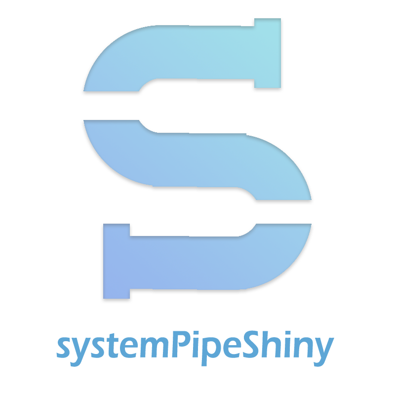

**systemPipeShiny**
(SPS) extends the widely used [systemPipeR](/spr/) 
(SPR) workflow
environment with a versatile graphical user interface provided by a [Shiny
App](https://shiny.rstudio.com). This allows non-R users, such as
experimentalists, to run many systemPipeR's workflow designs, control, and
visualization functionalities interactively without requiring knowledge of R.
Most importantly, `SPS` has been designed as a general purpose framework for
interacting with other R packages in an intuitive manner. Like most Shiny Apps,
SPS can be used on both local computers as well as centralized server-based
deployments that can be accessed remotely as a public web service for using
SPR's functionalities with community and/or private data. The framework can
integrate many core packages from the R/Bioconductor ecosystem. Examples of
SPS' current functionalities include: 

- A default interactive workflow module to 
create experimental designs, visualize and customize workflow topologies with previews, and 
programming free workflow execution within the application. 
- An interactive module with extensive plot options to visualize downstream analysis of a RNA-Seq workflow.
- A quick ggplot module to make all variety of scientific plots from any user defined 
tabular data. 
- An extendable set of visualization functionalities makes it easy to design 
custom Shiny Apps under SPS framework without any knowledge of Shiny. 
- A 'Canvas Workbench' to manage complex visual results. It allows users to 
organize and to compare plots in an efficient manner combined
with a session screenshot feature to edit scientific and publishable figures. 
- Three other supporting packages to help all users from beginners and advanced developers 
to extend under current SPS framework or on their own Shiny Apps. 

## Demo
View our online demo app:

<a 
href="https://tgirke.shinyapps.io/systemPipeShiny/" 
style="background-color: #eee;border-radius: 10px;border: #c2daf7f5 solid 4px; font-weight: 800; font-size: 1.5rem; margin-left: 40%">
Try a demo!
</a>

## Other packages in systemPipeShiny

| Package | Description | Documents | Demo |
| --- | --- | --- | --- |
|[systemPipeShiny](https://github.com/systemPipeR/systemPipeShiny) | SPS main package |[website](https://systempipe.org/sps/)|[demo](https://tgirke.shinyapps.io/systemPipeShiny/)|
|[spsComps](https://github.com/lz100/spsComps) | SPS UI and server components |[website](https://systempipe.org/sps/dev/spscomps/)|[demo](https://lezhang.shinyapps.io/spsComps)|
|[spsUtil](https://github.com/lz100/spsUtil) | SPS utility functions |[website](https://systempipe.org/sps/dev/spsutil/)|NA|
|[drawer](https://github.com/lz100/drawer) | SPS interactive image editing tool |[website](https://systempipe.org/sps/dev/drawer/)|[demo](https://lezhang.shinyapps.io/drawer)|

