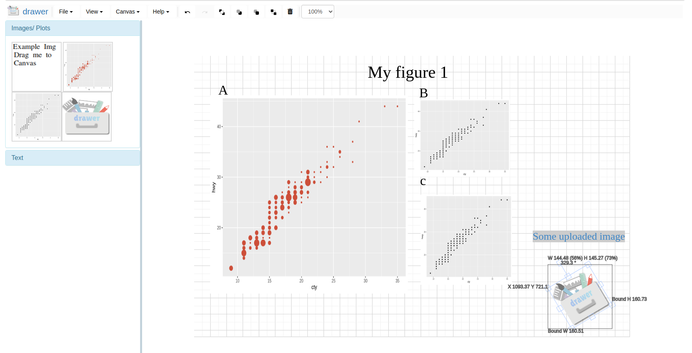

The {drawer} package offers an interactive image editing tool that can be added as part of the 
HTML in Shiny, R markdown or any type of HTML document. Often times, plots, 
photos are embedded in the web application/file. {drawer} can take screenshots 
of these image-like elements, or any part of the HTML document and send to an 
image editing space called "canvas" to allow users immediately edit the 
screenshot(s) within the same document. Users can quickly combine, compare 
different screenshots, upload their own images and maybe make a scientific figure.

## Features 

- {drawer} is built with 99% javascript + HTML + CSS, there is **no need to have a Shiny server** or any other 
types of server in the back-end. That's why you can use it in any HTML document. 
**All you need is a modern web browser**, like Chrome or Firefox (IE will not work).
- Shiny and R markdown compatible.
- Screenshot any element in the page and edit in canvas or download it *png* or *jpg*
- Drag and upload your own images.

Drawer UI screenshot 

## Installation 

Read the [developer tools](..) main page, not repeating here. 

## Functions reference manual
Please read the [reference manuals](/sps/sps_funcs) for details of every function. 

## Some video demos

### Basic looking and options 
<video width="100%" height="100%" controls>
  <source src="basic_and_options.mp4" type="video/mp4">
</video>

### Capture
Use the capture buttons to capture plots, images and other elements in the same 
document.

<video width="100%" height="100%" controls>
  <source src="capture_plots.mp4" type="video/mp4">
</video>

### Add text

<video width="100%" height="100%" controls>
  <source src="add_text.mp4" type="video/mp4">
</video>

### Upload your own images
You can upload one or multiple your own images at once.

<video width="100%" height="100%" controls>
  <source src="upload_img.mp4" type="video/mp4">
</video>
